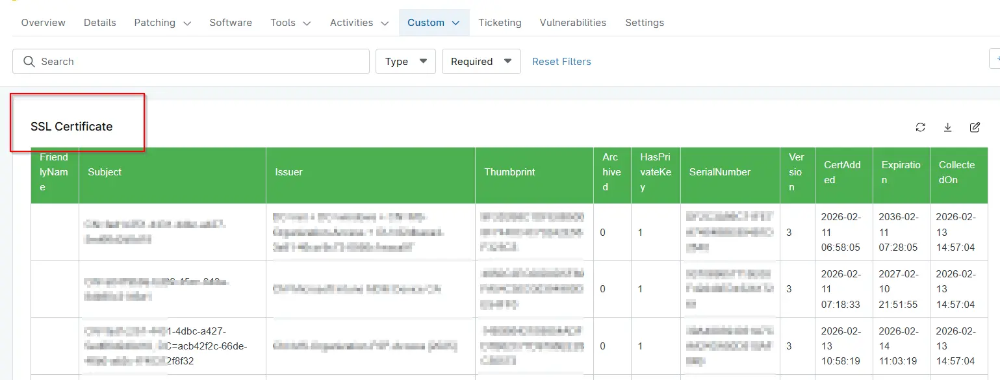

## Summary
List of all SSL certificates in the personal certificate repository. This Data is populated by [SSL Certificate Audit](/docs/3c9e2ed2-f805-4da9-85fb-7fa1d1d146f5)` automation.

## Details

| Label | Field Name | Definition Scope | Type | Required | Default Value | Technician Permission | Automation Permission | API Permission | Description | Tool Tip | Footer Text |  Custom Field Tab Name |
| ----- | ---- | ---------------- | ---- | -------- | ------------- | --------------------- | --------------------- | -------------- | ----------- | -------- | ----------- | ----------- |
| cPVAL SSL certificate Audit | cpvalSslCertificateAudit | `Devices` | WYSIWYG | `False` | | Editable | Read_Write | Read_Write | List of all SSL certificates in the personal certificate repository. This Data is populated by `SSL Certificate Audit` automation. | List of all SSL certificates in the personal certificate repository. |List of all SSL certificates in the personal certificate repository. | SSL Certificate |

## Dependencies
- [Solution - SSL Certificate Audit](/docs/cf5acc69-183c-4838-9484-2f3d9a247877)

## Custom Field Creation

- [Custom Field Configuration](https://github.com/ProVal-Tech/ninjarmm/blob/main/custom-fields/cpval-ssl-certificate-audit.toml)

## Sample Screenshot

