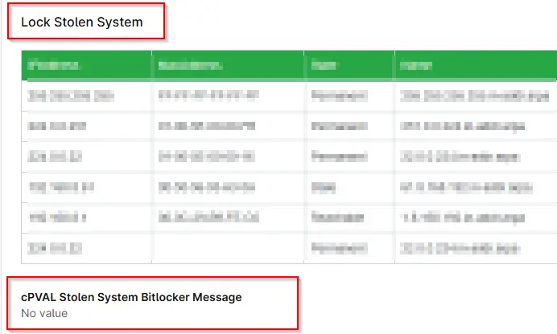

## Summary
The message to be displayed on the BitLocker lock screen. This custom field is used by the `Lock Stolen System` solution during system lockdown.

## Details

| Label | Field Name | Definition Scope | Type | Required | Default Value | Technician Permission | Automation Permission | API Permission | Description | Tool Tip | Footer Text |  Custom Field Tab Name |
| ----- | ---- | ---------------- | ---- | -------- | ------------- | --------------------- | --------------------- | -------------- | ----------- | -------- | ----------- | ----------- |
| cPVAL Stolen System Bitlocker Message | cpvalStolenSystemBitlockerMessage | `Devices` | Text | No | | Editable | Read_Write | Read_Write | The message to be displayed on the BitLocker lock screen. This custom field is used by the `Lock Stolen System` solution during system lockdown. | The message to be displayed on the BitLocker lock screen. | The message to be displayed on the BitLocker lock screen. | Lock Stolen System |

## Dependencies

- [Solution  - Lock Stolen System](/docs/13b4df99-df9b-4a57-bc0f-8675c68be028)

## Custom Field Creation

- [Custom Field Configuration](https://github.com/ProVal-Tech/ninjarmm/blob/main/custom-fields/cpval-stolen-system-bitlocker-message.toml)

## Sample Screenshot

  
