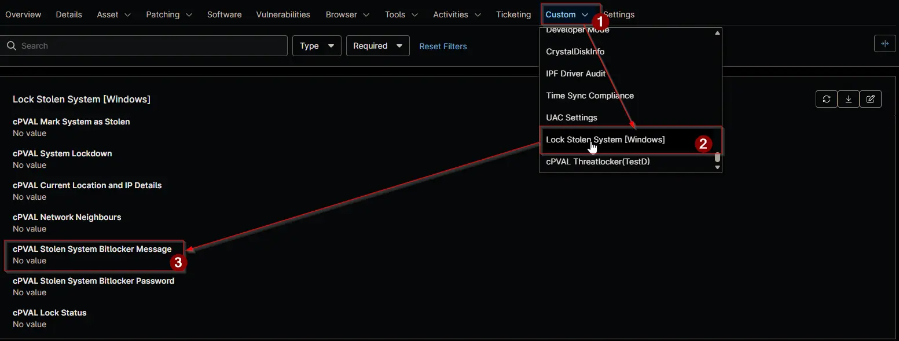

## Summary

The message shown on a device locked by the [Lock Stolen System](/docs/13b4df99-df9b-4a57-bc0f-8675c68be028) solution: on the BitLocker recovery screen on Windows, and on the login window and the FileVault screen on a Mac. Use it to tell whoever has the device how to return it. If it's empty, the device shows `Your device has been locked due to suspicious activity.` The field is on the **Lock Stolen System [Windows]** tab of Windows devices and the **Lock Stolen System [Macintosh]** tab of Macs.

## Details

| Label | Field Name | Example | Definition Scope | Type | Required | Default Value | Dropdown Options | Editable | Custom Field Tab |
| ----- | ---------- | ------- | ---------------- | ---- | -------- | ------------- | ---------------- | -------- | ---------------- |
| cPVAL Stolen System BitLocker Message | cpvalStolenSystemBitlockerMessage | This device belongs to Contoso and has been reported stolen. Call 555-0100 to return it. | `Device` | Text | No |  | | Yes | <ul><li>`Lock Stolen System [Windows]`</li><li>`Lock Stolen System [Macintosh]`</li></ul> |

## Dependencies

- [Automation: Lock Stolen System [Windows]](/docs/0f78be64-557a-4c0e-b7cf-e2ba41e71374)
- [Automation: Lock Stolen System [Macintosh]](/docs/08b38e83-0836-49de-b185-dbfc97a0f249)
- [Solution: Lock Stolen System](/docs/13b4df99-df9b-4a57-bc0f-8675c68be028)

## Custom Field Creation

- [Custom Field Configuration](https://github.com/ProVal-Tech/ninjarmm/blob/main/custom-fields/cpval-stolen-system-bitlocker-message.toml)

## Sample Screenshot

## Changelog

### 2026-11-05

- Added the field to Mac devices on the Lock Stolen System [Macintosh] tab, where the message shows on the login window and the FileVault screen, and moved it to the Lock Stolen System [Windows] tab on Windows devices.

### 2026-02-25

- Initial version of the document
