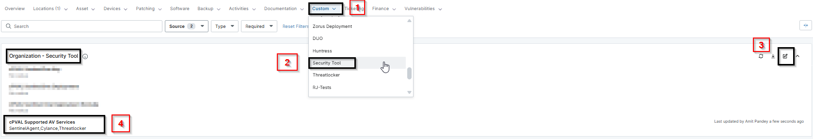
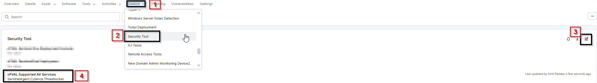

## Summary

This custom field will require the list of AV that are active and running; if found, then the Defender gets disabled. Provide the value of AVs in a comma-separated list within the single quotes.
For example: SentinelAgent,AnotherAVService

## Details

| Label | Field Name | Definition Scope | Type | Required | Default Value | Technician Permission | Automation Permission | API Permission | Description | Tool Tip | Footer Text |  Custom Field Tab Name |
| ----- | ---- | ---------------- | ---- | -------- | ------------- | --------------------- | --------------------- | -------------- | ----------- | -------- | ----------- | ----------- |
| cPVAL Supported AV Services | cpvalSupportedAvServices | `Organization`, `Location`, `Device` | Text | False |  | Editable | Read/Write | Read/Write | This custom field will require the list of AV that are active and running; if found, then the Defender gets disabled. Provide the value of AVs in a comma-separated list within the single quotes. For example: SentinelAgent,AnotherAVService |  | Supported AV Lists | Security Tool |

## Dependencies

- [Solution - Disable Defender](/docs/496a399f-7746-4cc6-9c31-476193d5ee9e)

## Custom Field Creation

- [Custom Field Configuration](https://github.com/ProVal-Tech/ninjarmm/blob/main/custom-fields/cpval-supported-av-services.toml)

## Sample Screenshot

## Changelog

- Initial version of the document