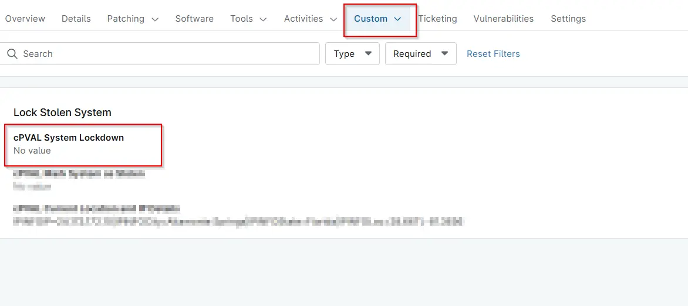

---

id: '4b18c9bf-8aea-41a5-8242-77dfcfd0042a'
slug: /4b18c9bf-8aea-41a5-8242-77dfcfd0042a
title: 'cPVAL System Lockdown'
title_meta: 'cPVAL System Lockdown'
keywords: ['lock','stolen','system']
description: 'Mark this to lock down the machine once it comes online. `Lock Stolen System` solution will not enable BitLocker and shut down the computer if this is not flagged.'
tags: ['connectwise']
draft: false
unlisted: false

last_update:
  date: 2026-02-11
---

## Summary
Mark this to lock down the machine once it comes online. 'Lock Stolen System' solution will not enable BitLocker and shut down the computer if this is not flagged.

## Details

| Label | Field Name | Definition Scope | Type | Required | Default Value | Technician Permission | Automation Permission | API Permission | Description | Tool Tip | Footer Text |  Custom Field Tab Name |
| ----- | ---- | ---------------- | ---- | -------- | ------------- | --------------------- | --------------------- | -------------- | ----------- | -------- | ----------- | ----------- |
| cPVAL System Lockdown | cpvalSystemLockdown  | `Devices` | Checkbox | No | |  Editable | Read_Write | Read_Write | Mark this to lock down the machine once it comes online. 'Lock Stolen System' solution will not enable BitLocker and shut down the computer if this is not flagged. | Check this to lock down the machine once it comes online.| Check this to lock down the machine once it comes online. | Lock Stolen System |

## Dependencies
- [Solution  - Lock Stolen System](/docs/13b4df99-df9b-4a57-bc0f-8675c68be028)

## Custom Field Creation

- [Custom Field Configuration](https://github.com/ProVal-Tech/ninjarmm/blob/main/custom-fields/cpval-system-lockdown.toml)

## Sample Screenshot

## Changelog

### 2026-02-10

- Initial version of the document
