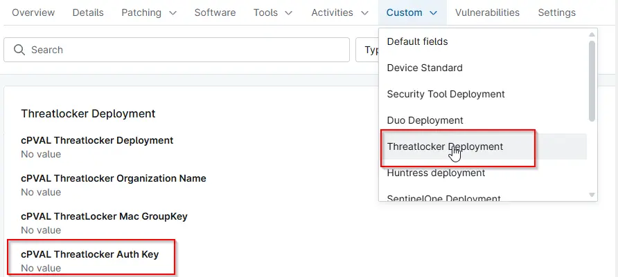

## Summary

Threatlocker Authentication Key to deploy threatlocker Agent on windows machines

## Details

| Label | Field Name | Definition Scope | Type | Required | Default Value | Technician Permission | Automation Permission | API Permission | Description | Tool Tip | Footer Text |
| ----- | ---- | ---------------- | ---- | -------- | ------------- | --------------------- | --------------------- | -------------- | ----------- | -------- | ----------- |
| cPVAL Threatlocker Auth Key | cPVALThreatlockerAuthKey | Organization | Text | True | - | Editable | Read/Write | Read/Write | Threatlocker Authentication Key to deploy threatlocker Agent on windows machines | - | - |

## Dependencies

- [Automation - Threatlocker Deployment](/docs/1196b011-bfba-486a-8653-92066f19e527)
- [Solution - Threatlocker Deployment [NinjaOne]](/docs/a1efd808-41ad-4dee-9ea1-ff0c2a36e019)

## Custom Field Creation

- [Custom Field Configuration](https://github.com/ProVal-Tech/ninjarmm/blob/main/custom-fields/cpval-threatlocker-auth-key.toml)

## Sample Screenshot

