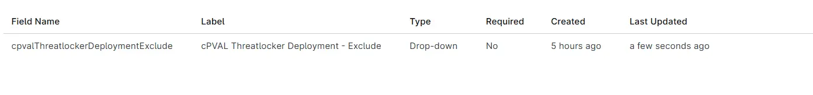
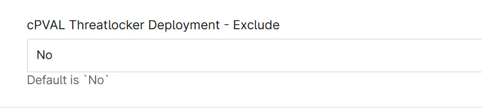

## Summary

Enable this custom field to exclude the location or device from ThreatLocker Deployment.

## Details

| Label | Field Name | Definition Scope | Type | Option Value | Default Value | Required  | Technician Permission | Automation Permission | API Permission | Description | Tool Tip | Footer Text |
| ----- | ---------- | ---------------- | ---- | ------------ | ------------- | --------- | --------------------- | --------------------- | -------------- | ----------- | -------- | ----------- |
| cPVAL ThreatLocker Deployment - Exclude | cpvalThreatLockerDeploymentExclude| `Device`, `Location` | drop-down | `Yes`, `No` | `No` | False | Editable | Read/Write | Read/Write | Enable this custom field to exclude the location or device from ThreatLocker Deployment. | Default is `No` | cPVAL Huntress Install - Exclude |

## Dependencies

- [Solution - ThreatLocker Deployment [NinjaOne]](/docs/a1efd808-41ad-4dee-9ea1-ff0c2a36e019)  

## Custom Field Creation

## Completed Custom Field

## Example

