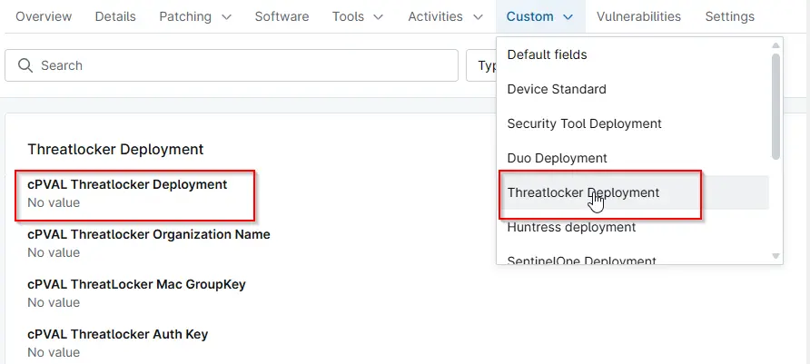

## Summary

Enables Threatlocker auto-deployment for Windows or both Windows and Macintosh machines at the organization level.

## Details

| Label | Field Name | Definition Scope | Type | Option Value | Default Value | Required  | Technician Permission | Automation Permission | API Permission | Description | Tool Tip | Footer Text |
| ----- | ---------- | ---------------- | ---- | ------------ | ------------- | --------- | --------------------- | --------------------- | -------------- | ----------- | -------- | ----------- |
| cPVAL Threatlocker Deployment | cpvalThreatlockerDeployment | Organization | drop-down | `All`, `Windows`, `Windows and Macintosh`, `Disabled`, `windows workstations`, `windows servers and Macs`, `windows workstaions and macs`, `windows servers`, `macs`,  | `Disabled` | False | Editable | Read/Write | Read/Write | Enables Threatlocker auto-deployment for Windows or both Windows and Macintosh machines at the organization level. |  |  |

## Dependencies

- [Solution - Threatlocker Deployment [NinjaOne]](/docs/a1efd808-41ad-4dee-9ea1-ff0c2a36e019)  
- [Automation - Threatlocker Deployment](/docs/1196b011-bfba-486a-8653-92066f19e527)  
- [Automation - Threatlocker Deployment [MAC]](/docs/11444307-4a3f-4388-b5c5-096a50725b4e)  
- [Compound Conditions - Threatlocker Depoyment - Windows](/docs/d7ba7616-f11d-4961-90fb-9e7cf9ed6f28)  
- [Compound Conditions - Threatlocker Deployment - MAC](/docs/73470264-63c3-43d1-a727-1e813cfe768d)

### Custom Field Creation

- [Custom Field Configuration](https://github.com/ProVal-Tech/ninjarmm/blob/main/custom-fields/cpval-threatlocker-deployment.toml)

## Sample Screenshot

