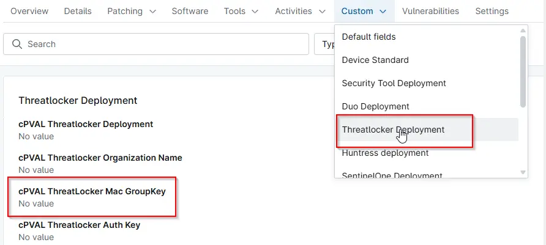

## Summary

Stores the Threatlocker group key for agent deployment on Macintosh machines

## Details

| Label | Field Name | Definition Scope | Type | Required | Default Value | Technician Permission | Automation Permission | API Permission | Description | Tool Tip | Footer Text |
| ----- | ---- | ---------------- | ---- | -------- | ------------- | --------------------- | --------------------- | -------------- | ----------- | -------- | ----------- |
| cPVAL ThreatLocker Mac GroupKey | cpvalThreatlockerMacGroupkey | Organization | Text | False | - | Editable | Read/Write | Read/Write | Stores the Threatlocker group key for agent deployment on Macintosh machines | - | - |

## Dependencies

- [Threatlocker Deployment [MAC]](/docs/11444307-4a3f-4388-b5c5-096a50725b4e)  
- [Solution - Threatlocker Deployment [NinjaOne]](/docs/a1efd808-41ad-4dee-9ea1-ff0c2a36e019)

## Custom Field Creation

- [Custom Field Configuration](https://github.com/ProVal-Tech/ninjarmm/blob/main/custom-fields/cpval-threatlocker-mac-groupkey.toml)

## Sample Screenshot

