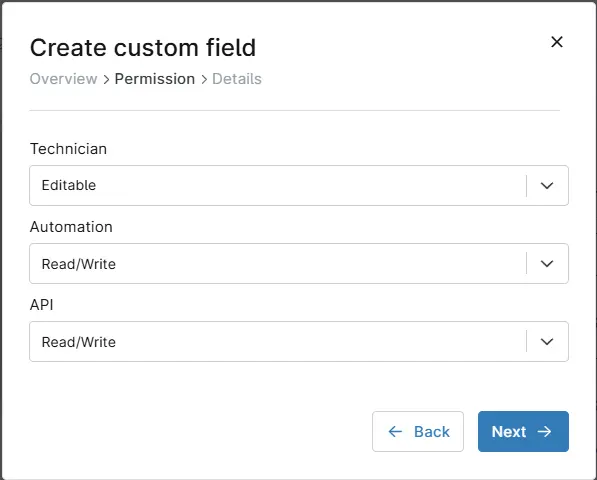

## Summary
Stores the Threatlocker group key for agent deployment on Macintosh machines

## Details

| Label | Field Name | Definition Scope | Type | Required | Default Value | Technician Permission | Automation Permission | API Permission | Description | Tool Tip | Footer Text |
| ----- | ---- | ---------------- | ---- | -------- | ------------- | --------------------- | --------------------- | -------------- | ----------- | -------- | ----------- |
| 	
cPVAL ThreatLocker Mac GroupKey | cpvalThreatlockerMacGroupkey | Organization | Text | False | - | Editable | Read/Write | Read/Write | Stores the Threatlocker group key for agent deployment on Macintosh machines | - | - |

## Dependencies
- [Threatlocker Deployment [MAC]](/docs/11444307-4a3f-4388-b5c5-096a50725b4e)

## Custom Field Creation

### Step 1

Navigate to the `Administration` menu, then proceed to `Devices` and select `Global Custom Fields`.  

### Step 2

Locate the `Add` button on the right-hand side of the screen and click on it.  
  

### Step 3

After clicking the `Add` button, select the `Field` button that appears.  

The following Pop-up screen will appear:  

### Step 4

Custom Field Type: `Text`  
Select Text for the `Custom field type` and click `Continue` to proceed.

### Step 5

A Pop-up screen will appear. Set the following details in the `Overview` section and click the `Next` button.

Label: `cPVAL ThreatLocker Mac GroupKey`  
Name: `cpvalThreatlockerMacGroupkey`  
Definition Scope: `Organization`  
Custom field is required: `<Leave it unchecked>`

Clicking the `Next` button will take you to the `Permission` section.

### Step 5

Set the following details in the `Permission` section and click the `Next` button.

Technician: `Editable`  
Automation: `Read/Write`  
API: `Read/Write`  

### Step 6

Set the following details in the `Details` section and click the `Create` button to complete the creation of custom field.

**Description:** `Stores the Threatlocker group key for agent deployment on Macintosh machines`    
**Tooltip text:** `<Leave it blank>`   
**Footer text:** `<Leave it blank>`  

### Completed Custom Field

### Example

