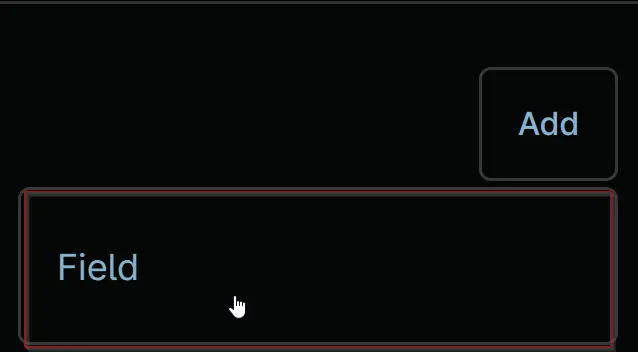

## Summary
Organization name to be used for Threatlocker deployment. If deploying to an existing organization, the name must match the organization's name in the ThreatLocker portal.

## Details

| Label | Field Name | Definition Scope | Type | Required | Default Value | Technician Permission | Automation Permission | API Permission | Description | Tool Tip | Footer Text |
| ----- | ---- | ---------------- | ---- | -------- | ------------- | --------------------- | --------------------- | -------------- | ----------- | -------- | ----------- |
| cPVAL Threatlocker Organization Name | cPVALThreatlockerOrganizationName | Organization | Text | False | - | Editable | Read/Write | Read/Write | Organization name to be used for Threatlocker deployment. If deploying to an existing organization, the name must match the organization's name in the ThreatLocker portal. | - | - |

## Dependencies
- [Automation - Threatlocker Deployment](/docs/1196b011-bfba-486a-8653-92066f19e527) 

## Custom Field Creation

### Step 1

Navigate to the `Administration` menu, then proceed to `Devices` and select `Global Custom Fields`.  

](../../../
### Step 2

Locate the `Add` button on the right-hand side of the screen and click on it.  
  

### Step 3

After clicking the `Add` button, select the `Field` button that appears.  

The following Pop-up screen will appear:  

### Step 4

Custom Field Type: `Text`
Select Text for the Custom field type and click Continue to proceed.

### Step 5

A Pop-up screen will appear. Set the following details in the Overview section and click the Next button.

Label: `cPVAL Threatlocker Organization Name`  
Name: `cpvalThreatlockerOrganizationName`  
Definition Scope: `Organization`  
Custom field is required: `<Leave it unchecked>`

### Step 6

Set the following details in the `Details` section and click the `Create` button to complete the creation of custom field.

**Description:** `Organization name to be used for Threatlocker deployment. If deploying to an existing organization, the name must match the organization's name in the ThreatLocker portal`    
**Tooltip text:** `<Leave it blank>`   
**Footer text:** `<Leave it blank>`  

### Completed Custom Field

### Example

