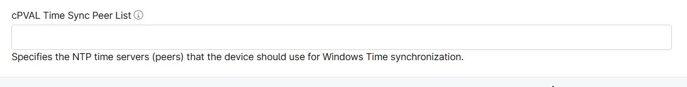

## Summary
Custom Field to specify the NTP time servers (peers) that the device should use for Windows Time synchronization.E.g. 'us.pool.ntp.org', 'time.nist.gov'.

## Details

| Label | Field Name | Definition Scope | Type | Required | Default Value | Technician Permission | Automation Permission | API Permission | Custom Field Tab Name |
| ----- | ----- | ----- | ----- | ----- | ----- | ----- | ----- | ----- | ----- | 
| cPVAL Time Sync Peer List | cpvalTimeSyncPeerList |  `Organization`, `Location`, `Device`  | Text | False | | Read Only | Read/Write | Read/Write | Time Sync Compliance |

## Dependencies

- [Solution - Time Sync Compliance](/docs/49acbca5-5fa4-4f75-bbbc-595cec9a7e29)

## Custom Field Creation

- [Custom Field Configuration](https://github.com/ProVal-Tech/ninjarmm/blob/main/custom-fields/cpval-time-sync-peer-list.toml)

## Sample Screenshot

## Changelog

### 2026-09-30

- Initial version of the document