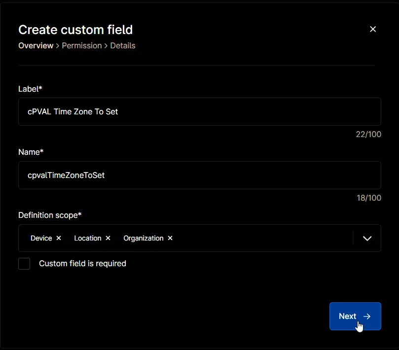
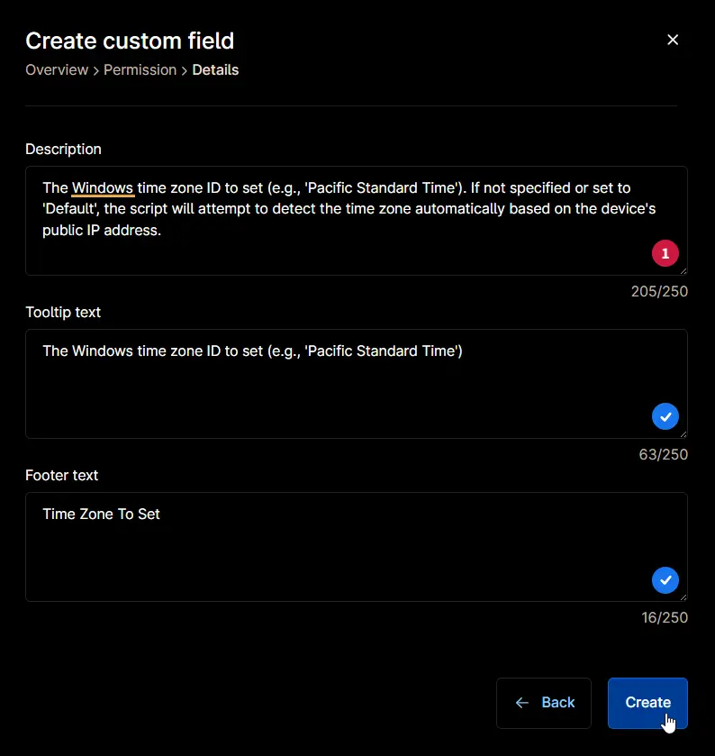
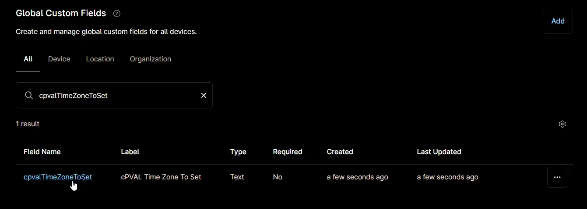
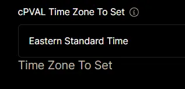

## Summary

The Windows time zone ID to set (e.g., 'Pacific Standard Time'). If not specified or set to 'Default', the script will attempt to detect the time zone automatically based on the device's public IP address.

## Details

| Label | Field Name | Definition Scope | Type | Required | Default Value | Technician Permission | Automation Permission | API Permission | Description | Tool Tip | Footer Text |
| ----- | ---- | ---------------- | ---- | -------- | ------------- | --------------------- | --------------------- | -------------- | ----------- | -------- | ----------- |
| cPVAL Time Zone To Set | cpvalTimeZoneToSet | `Organization`, `Location`, `Device` | Text | False | | Editable | Read/Write | Read/Write | The Windows time zone ID to set (e.g., 'Pacific Standard Time'). If not specified or set to 'Default', the script will attempt to detect the time zone automatically based on the device's public IP address. | The Windows time zone ID to set (e.g., 'Pacific Standard Time') | Time Zone To Set |

## Supported Time Zones

| IANA Time Zone | Windows Time Zone |
| -------------- | ----------------- |
| Africa/Abidjan | Greenwich Standard Time |
| Africa/Accra | Greenwich Standard Time |
| Africa/Addis_Ababa | E. Africa Standard Time |
| Africa/Algiers | W. Central Africa Standard Time |
| Africa/Asmara | E. Africa Standard Time |
| Africa/Bamako | Greenwich Standard Time |
| Africa/Bangui | W. Central Africa Standard Time |
| Africa/Banjul | Greenwich Standard Time |
| Africa/Bissau | Greenwich Standard Time |
| Africa/Blantyre | South Africa Standard Time |
| Africa/Brazzaville | W. Central Africa Standard Time |
| Africa/Bujumbura | South Africa Standard Time |
| Africa/Cairo | Egypt Standard Time |
| Africa/Casablanca | Morocco Standard Time |
| Africa/Ceuta | Romance Standard Time |
| Africa/Conakry | Greenwich Standard Time |
| Africa/Dakar | Greenwich Standard Time |
| Africa/Dar_es_Salaam | E. Africa Standard Time |
| Africa/Djibouti | E. Africa Standard Time |
| Africa/Douala | W. Central Africa Standard Time |
| Africa/El_Aaiun | Morocco Standard Time |
| Africa/Freetown | Greenwich Standard Time |
| Africa/Gaborone | South Africa Standard Time |
| Africa/Harare | South Africa Standard Time |
| Africa/Johannesburg | South Africa Standard Time |
| Africa/Juba | South Sudan Standard Time |
| Africa/Kampala | E. Africa Standard Time |
| Africa/Khartoum | Sudan Standard Time |
| Africa/Kigali | South Africa Standard Time |
| Africa/Kinshasa | W. Central Africa Standard Time |
| Africa/Lagos | W. Central Africa Standard Time |
| Africa/Libreville | W. Central Africa Standard Time |
| Africa/Lome | Greenwich Standard Time |
| Africa/Luanda | W. Central Africa Standard Time |
| Africa/Lubumbashi | South Africa Standard Time |
| Africa/Lusaka | South Africa Standard Time |
| Africa/Malabo | W. Central Africa Standard Time |
| Africa/Maputo | South Africa Standard Time |
| Africa/Maseru | South Africa Standard Time |
| Africa/Mbabane | South Africa Standard Time |
| Africa/Mogadishu | E. Africa Standard Time |
| Africa/Monrovia | Greenwich Standard Time |
| Africa/Nairobi | E. Africa Standard Time |
| Africa/Ndjamena | W. Central Africa Standard Time |
| Africa/Niamey | W. Central Africa Standard Time |
| Africa/Nouakchott | Greenwich Standard Time |
| Africa/Ouagadougou | Greenwich Standard Time |
| Africa/Porto-Novo | W. Central Africa Standard Time |
| Africa/Sao_Tome | Sao Tome Standard Time |
| Africa/Tripoli | Libya Standard Time |
| Africa/Tunis | W. Central Africa Standard Time |
| Africa/Windhoek | Namibia Standard Time |
| America/Adak | Aleutian Standard Time |
| America/Anchorage | Alaskan Standard Time |
| America/Araguaina | Tocantins Standard Time |
| America/Argentina/Buenos_Aires | Argentina Standard Time |
| America/Argentina/Catamarca | Argentina Standard Time |
| America/Argentina/Cordoba | Argentina Standard Time |
| America/Argentina/Jujuy | Argentina Standard Time |
| America/Argentina/La_Rioja | Argentina Standard Time |
| America/Argentina/Mendoza | Argentina Standard Time |
| America/Argentina/Rio_Gallegos | Argentina Standard Time |
| America/Argentina/Salta | Argentina Standard Time |
| America/Argentina/San_Juan | Argentina Standard Time |
| America/Argentina/San_Luis | Argentina Standard Time |
| America/Argentina/Tucuman | Argentina Standard Time |
| America/Argentina/Ushuaia | Argentina Standard Time |
| America/Asuncion | Paraguay Standard Time |
| America/Atikokan | SA Pacific Standard Time |
| America/Bahia | Bahia Standard Time |
| America/Bahia_Banderas | Central Standard Time (Mexico) |
| America/Barbados | SA Western Standard Time |
| America/Belem | SA Eastern Standard Time |
| America/Belize | Central America Standard Time |
| America/Blanc-Sablon | SA Western Standard Time |
| America/Boa_Vista | SA Western Standard Time |
| America/Bogota | SA Pacific Standard Time |
| America/Boise | Mountain Standard Time |
| America/Cambridge_Bay | Mountain Standard Time |
| America/Campo_Grande | Central Brazilian Standard Time |
| America/Cancun | Eastern Standard Time (Mexico) |
| America/Caracas | Venezuela Standard Time |
| America/Cayenne | SA Eastern Standard Time |
| America/Chicago | Central Standard Time |
| America/Chihuahua | Mountain Standard Time (Mexico) |
| America/Costa_Rica | Central America Standard Time |
| America/Creston | US Mountain Standard Time |
| America/Cuiaba | Central Brazilian Standard Time |
| America/Curacao | SA Western Standard Time |
| America/Danmarkshavn | UTC |
| America/Dawson | Yukon Standard Time |
| America/Dawson_Creek | US Mountain Standard Time |
| America/Denver | Mountain Standard Time |
| America/Detroit | Eastern Standard Time |
| America/Edmonton | Mountain Standard Time |
| America/Eirunepe | SA Pacific Standard Time |
| America/El_Salvador | Central America Standard Time |
| America/Fort_Nelson | US Mountain Standard Time |
| America/Fortaleza | SA Eastern Standard Time |
| America/Glace_Bay | Atlantic Standard Time |
| America/Godthab | Greenland Standard Time |
| America/Goose_Bay | Atlantic Standard Time |
| America/Grand_Turk | Turks And Caicos Standard Time |
| America/Guatemala | Central America Standard Time |
| America/Guayaquil | SA Pacific Standard Time |
| America/Guyana | SA Western Standard Time |
| America/Halifax | Atlantic Standard Time |
| America/Havana | Cuba Standard Time |
| America/Hermosillo | US Mountain Standard Time |
| America/Indiana/Indianapolis | US Eastern Standard Time |
| America/Indiana/Knox | Central Standard Time |
| America/Indiana/Marengo | US Eastern Standard Time |
| America/Indiana/Petersburg | Eastern Standard Time |
| America/Indiana/Tell_City | Central Standard Time |
| America/Indiana/Vevay | US Eastern Standard Time |
| America/Indiana/Vincennes | Eastern Standard Time |
| America/Indiana/Winamac | Eastern Standard Time |
| America/Inuvik | Mountain Standard Time |
| America/Iqaluit | Eastern Standard Time |
| America/Jamaica | SA Pacific Standard Time |
| America/Juneau | Alaskan Standard Time |
| America/Kentucky/Louisville | Eastern Standard Time |
| America/Kentucky/Monticello | Eastern Standard Time |
| America/La_Paz | SA Western Standard Time |
| America/Lima | SA Pacific Standard Time |
| America/Los_Angeles | Pacific Standard Time |
| America/Maceio | SA Eastern Standard Time |
| America/Managua | Central America Standard Time |
| America/Manaus | SA Western Standard Time |
| America/Martinique | SA Western Standard Time |
| America/Matamoros | Central Standard Time |
| America/Mazatlan | Mountain Standard Time (Mexico) |
| America/Menominee | Central Standard Time |
| America/Merida | Central Standard Time (Mexico) |
| America/Metlakatla | Alaskan Standard Time |
| America/Mexico_City | Central Standard Time (Mexico) |
| America/Miquelon | Saint Pierre Standard Time |
| America/Moncton | Atlantic Standard Time |
| America/Monterrey | Central Standard Time (Mexico) |
| America/Montevideo | Montevideo Standard Time |
| America/Nassau | Eastern Standard Time |
| America/New_York | Eastern Standard Time |
| America/Nipigon | Eastern Standard Time |
| America/Nome | Alaskan Standard Time |
| America/Noronha | UTC-02 |
| America/North_Dakota/Beulah | Central Standard Time |
| America/North_Dakota/Center | Central Standard Time |
| America/North_Dakota/New_Salem | Central Standard Time |
| America/Ojinaga | Mountain Standard Time |
| America/Panama | SA Pacific Standard Time |
| America/Pangnirtung | Eastern Standard Time |
| America/Paramaribo | SA Eastern Standard Time |
| America/Phoenix | US Mountain Standard Time |
| America/Port-au-Prince | Eastern Standard Time |
| America/Port_of_Spain | SA Western Standard Time |
| America/Porto_Velho | SA Western Standard Time |
| America/Puerto_Rico | SA Western Standard Time |
| America/Punta_Arenas | Magallanes Standard Time |
| America/Rainy_River | Central Standard Time |
| America/Rankin_Inlet | Central Standard Time |
| America/Recife | SA Eastern Standard Time |
| America/Regina | Canada Central Standard Time |
| America/Resolute | Central Standard Time |
| America/Rio_Branco | SA Pacific Standard Time |
| America/Santarem | SA Eastern Standard Time |
| America/Santiago | Pacific SA Standard Time |
| America/Santo_Domingo | SA Western Standard Time |
| America/Sao_Paulo | E. South America Standard Time |
| America/Scoresbysund | Azores Standard Time |
| America/Sitka | Alaskan Standard Time |
| America/St_Johns | Newfoundland Standard Time |
| America/Swift_Current | Canada Central Standard Time |
| America/Tegucigalpa | Central America Standard Time |
| America/Thule | Atlantic Standard Time |
| America/Thunder_Bay | Eastern Standard Time |
| America/Tijuana | Pacific Standard Time (Mexico) |
| America/Toronto | Eastern Standard Time |
| America/Vancouver | Pacific Standard Time |
| America/Whitehorse | Yukon Standard Time |
| America/Winnipeg | Central Standard Time |
| America/Yakutat | Alaskan Standard Time |
| America/Yellowknife | Mountain Standard Time |
| Antarctica/Casey | Central Pacific Standard Time |
| Antarctica/Davis | SE Asia Standard Time |
| Antarctica/DumontDUrville | West Pacific Standard Time |
| Antarctica/Macquarie | Tasmania Standard Time |
| Antarctica/Mawson | West Asia Standard Time |
| Antarctica/Palmer | Pacific SA Standard Time |
| Antarctica/Rothera | SA Eastern Standard Time |
| Antarctica/Syowa | E. Africa Standard Time |
| Antarctica/Troll | UTC |
| Antarctica/Vostok | Central Asia Standard Time |
| Asia/Almaty | Central Asia Standard Time |
| Asia/Amman | Jordan Standard Time |
| Asia/Anadyr | Russia Time Zone 11 |
| Asia/Aqtau | West Asia Standard Time |
| Asia/Aqtobe | West Asia Standard Time |
| Asia/Ashgabat | West Asia Standard Time |
| Asia/Atyrau | West Asia Standard Time |
| Asia/Baghdad | Arabic Standard Time |
| Asia/Baku | Azerbaijan Standard Time |
| Asia/Bangkok | SE Asia Standard Time |
| Asia/Barnaul | Altai Standard Time |
| Asia/Beirut | Middle East Standard Time |
| Asia/Bishkek | Central Asia Standard Time |
| Asia/Brunei | Singapore Standard Time |
| Asia/Chita | Transbaikal Standard Time |
| Asia/Choibalsan | Ulaanbaatar Standard Time |
| Asia/Colombo | Sri Lanka Standard Time |
| Asia/Damascus | Syria Standard Time |
| Asia/Dhaka | Bangladesh Standard Time |
| Asia/Dili | Tokyo Standard Time |
| Asia/Dubai | Arabian Standard Time |
| Asia/Dushanbe | West Asia Standard Time |
| Asia/Famagusta | Turkey Standard Time |
| Asia/Gaza | West Bank Standard Time |
| Asia/Hebron | West Bank Standard Time |
| Asia/Ho_Chi_Minh | SE Asia Standard Time |
| Asia/Hong_Kong | China Standard Time |
| Asia/Hovd | W. Mongolia Standard Time |
| Asia/Irkutsk | North Asia East Standard Time |
| Asia/Jakarta | SE Asia Standard Time |
| Asia/Jayapura | Tokyo Standard Time |
| Asia/Jerusalem | Israel Standard Time |
| Asia/Kabul | Afghanistan Standard Time |
| Asia/Kamchatka | Russia Time Zone 11 |
| Asia/Karachi | Pakistan Standard Time |
| Asia/Kathmandu | Nepal Standard Time |
| Asia/Khandyga | Yakutsk Standard Time |
| Asia/Kolkata | India Standard Time |
| Asia/Krasnoyarsk | North Asia Standard Time |
| Asia/Kuala_Lumpur | Singapore Standard Time |
| Asia/Kuching | Singapore Standard Time |
| Asia/Macau | China Standard Time |
| Asia/Magadan | Magadan Standard Time |
| Asia/Makassar | Singapore Standard Time |
| Asia/Manila | Singapore Standard Time |
| Asia/Nicosia | E. Europe Standard Time |
| Asia/Novokuznetsk | North Asia Standard Time |
| Asia/Novosibirsk | N. Central Asia Standard Time |
| Asia/Omsk | Omsk Standard Time |
| Asia/Oral | West Asia Standard Time |
| Asia/Phnom_Penh | SE Asia Standard Time |
| Asia/Pontianak | SE Asia Standard Time |
| Asia/Pyongyang | North Korea Standard Time |
| Asia/Qatar | Arab Standard Time |
| Asia/Qostanay | Central Asia Standard Time |
| Asia/Qyzylorda | Qyzylorda Standard Time |
| Asia/Riyadh | Arab Standard Time |
| Asia/Sakhalin | Sakhalin Standard Time |
| Asia/Samarkand | West Asia Standard Time |
| Asia/Seoul | Korea Standard Time |
| Asia/Shanghai | China Standard Time |
| Asia/Singapore | Singapore Standard Time |
| Asia/Srednekolymsk | Russia Time Zone 10 |
| Asia/Taipei | Taipei Standard Time |
| Asia/Tashkent | West Asia Standard Time |
| Asia/Tbilisi | Georgian Standard Time |
| Asia/Tehran | Iran Standard Time |
| Asia/Thimphu | Bangladesh Standard Time |
| Asia/Tokyo | Tokyo Standard Time |
| Asia/Tomsk | Tomsk Standard Time |
| Asia/Ulaanbaatar | Ulaanbaatar Standard Time |
| Asia/Urumqi | Central Asia Standard Time |
| Asia/Ust-Nera | Vladivostok Standard Time |
| Asia/Vladivostok | Vladivostok Standard Time |
| Asia/Yakutsk | Yakutsk Standard Time |
| Asia/Yangon | Myanmar Standard Time |
| Asia/Yekaterinburg | Ekaterinburg Standard Time |
| Asia/Yerevan | Caucasus Standard Time |
| Atlantic/Azores | Azores Standard Time |
| Atlantic/Bermuda | Atlantic Standard Time |
| Atlantic/Canary | GMT Standard Time |
| Atlantic/Cape_Verde | Cape Verde Standard Time |
| Atlantic/Faroe | GMT Standard Time |
| Atlantic/Madeira | GMT Standard Time |
| Atlantic/Reykjavik | Greenwich Standard Time |
| Atlantic/South_Georgia | UTC-02 |
| Atlantic/Stanley | SA Eastern Standard Time |
| Atlantic/St_Helena | Greenwich Standard Time |
| Australia/Adelaide | Cen. Australia Standard Time |
| Australia/Brisbane | E. Australia Standard Time |
| Australia/Broken_Hill | Cen. Australia Standard Time |
| Australia/Currie | Tasmania Standard Time |
| Australia/Darwin | AUS Central Standard Time |
| Australia/Eucla | Aus Central W. Standard Time |
| Australia/Hobart | Tasmania Standard Time |
| Australia/Lindeman | E. Australia Standard Time |
| Australia/Lord_Howe | Lord Howe Standard Time |
| Australia/Melbourne | AUS Eastern Standard Time |
| Australia/Perth | W. Australia Standard Time |
| Australia/Sydney | AUS Eastern Standard Time |
| Europe/Amsterdam | W. Europe Standard Time |
| Europe/Andorra | W. Europe Standard Time |
| Europe/Astrakhan | Astrakhan Standard Time |
| Europe/Athens | GTB Standard Time |
| Europe/Belgrade | Central Europe Standard Time |
| Europe/Berlin | W. Europe Standard Time |
| Europe/Brussels | Romance Standard Time |
| Europe/Bucharest | GTB Standard Time |
| Europe/Budapest | Central Europe Standard Time |
| Europe/Chisinau | E. Europe Standard Time |
| Europe/Copenhagen | Romance Standard Time |
| Europe/Dublin | GMT Standard Time |
| Europe/Gibraltar | W. Europe Standard Time |
| Europe/Helsinki | FLE Standard Time |
| Europe/Istanbul | Turkey Standard Time |
| Europe/Kaliningrad | Kaliningrad Standard Time |
| Europe/Kiev | FLE Standard Time |
| Europe/Kirov | Russia Time Zone 1 |
| Europe/Lisbon | GMT Standard Time |
| Europe/London | GMT Standard Time |
| Europe/Luxembourg | W. Europe Standard Time |
| Europe/Madrid | Romance Standard Time |
| Europe/Malta | W. Europe Standard Time |
| Europe/Minsk | Belarus Standard Time |
| Europe/Moscow | Russian Standard Time |
| Europe/Paris | Romance Standard Time |
| Europe/Prague | Central Europe Standard Time |
| Europe/Riga | FLE Standard Time |
| Europe/Rome | W. Europe Standard Time |
| Europe/Samara | Russia Time Zone 2 |
| Europe/Saratov | Saratov Standard Time |
| Europe/Simferopol | Russian Standard Time |
| Europe/Sofia | FLE Standard Time |
| Europe/Stockholm | W. Europe Standard Time |
| Europe/Tallinn | FLE Standard Time |
| Europe/Tirane | Central Europe Standard Time |
| Europe/Ulyanovsk | Astrakhan Standard Time |
| Europe/Uzhgorod | FLE Standard Time |
| Europe/Vienna | W. Europe Standard Time |
| Europe/Vilnius | FLE Standard Time |
| Europe/Volgograd | Volgograd Standard Time |
| Europe/Warsaw | Central European Standard Time |
| Europe/Zaporozhye | FLE Standard Time |
| Europe/Zurich | W. Europe Standard Time |
| Indian/Chagos | Central Asia Standard Time |
| Indian/Christmas | SE Asia Standard Time |
| Indian/Cocos | Myanmar Standard Time |
| Indian/Kerguelen | West Asia Standard Time |
| Indian/Mahe | Mauritius Standard Time |
| Indian/Maldives | West Asia Standard Time |
| Indian/Mauritius | Mauritius Standard Time |
| Indian/Reunion | Mauritius Standard Time |
| Pacific/Apia | Samoa Standard Time |
| Pacific/Auckland | New Zealand Standard Time |
| Pacific/Bougainville | Bougainville Standard Time |
| Pacific/Chatham | Chatham Islands Standard Time |
| Pacific/Easter | Easter Island Standard Time |
| Pacific/Efate | Central Pacific Standard Time |
| Pacific/Fakaofo | Tonga Standard Time |
| Pacific/Fiji | Fiji Standard Time |
| Pacific/Galapagos | Central America Standard Time |
| Pacific/Gambier | UTC-09 |
| Pacific/Guadalcanal | Central Pacific Standard Time |
| Pacific/Guam | West Pacific Standard Time |
| Pacific/Honolulu | Hawaiian Standard Time |
| Pacific/Kiritimati | Line Islands Standard Time |
| Pacific/Kosrae | Central Pacific Standard Time |
| Pacific/Kwajalein | UTC+12 |
| Pacific/Majuro | UTC+12 |
| Pacific/Marquesas | Marquesas Standard Time |
| Pacific/Nauru | UTC+12 |
| Pacific/Niue | UTC-11 |
| Pacific/Norfolk | Norfolk Standard Time |
| Pacific/Noumea | Central Pacific Standard Time |
| Pacific/Pago_Pago | UTC-11 |
| Pacific/Palau | Tokyo Standard Time |
| Pacific/Pitcairn | UTC-08 |
| Pacific/Pohnpei | West Pacific Standard Time |
| Pacific/Port_Moresby | West Pacific Standard Time |
| Pacific/Rarotonga | Hawaiian Standard Time |
| Pacific/Tahiti | Hawaiian Standard Time |
| Pacific/Tarawa | UTC+12 |
| Pacific/Tongatapu | Tonga Standard Time |
| Pacific/Wake | UTC+12 |
| Pacific/Wallis | UTC+12 |

## Dependencies

- [Solution: Manage Time Zone](/docs/3641dd0d-82d8-4137-b987-0b6c0d8238da)

## Custom Field Creation

### Step 1

Navigate to the `Administration` menu, then proceed to `Devices` and select `Global Custom Fields`.  

### Step 2

Locate the `Add` button on the right-hand side of the screen and click on it.  
  

### Step 3

After clicking the `Add` button, select the `Field` button that appears.  

The following Pop-up screen will appear:  

### Step 4

**Custom Field Type:** `Text`

Select `Text` for the `Custom field type` and click `Continue` to proceed.  

The following Pop-up screen will appear:  

### Step 5

Set the following details in the `Overview` section and click the `Next` button.

- **Label:** `cPVAL Time Zone To Set`  
- **Name:** `cpvalTimeZoneToSet`  
- **Definition Scope:** `Organization`, `Location`, `Device`
- **Custom field is required:** `<Leave it unchecked>`

Clicking the `Next` button will take you to the `Permission` section.  

### Step 6

Set the following details in the `Permission` section and click the `Next` button.  

- **Technician:** `Editable`  
- **Automation:** `Read/Write`  
- **API:** `Read/Write`

Clicking the `Next` button will take you to the `Details` tab.  

### Step 7

Fill in the following information in the `Details` section and click the `Create` button to create the `Custom Field`.

- **Description:** `The Windows time zone ID to set (e.g., 'Pacific Standard Time'). If not specified or set to 'Default', the script will attempt to detect the time zone automatically based on the device's public IP address.`  
- **Tooltip Text:** `The Windows time zone ID to set (e.g., 'Pacific Standard Time')`  
- **Footer Text:** `Time Zone To Set`  

## Completed Custom Field

## Example

