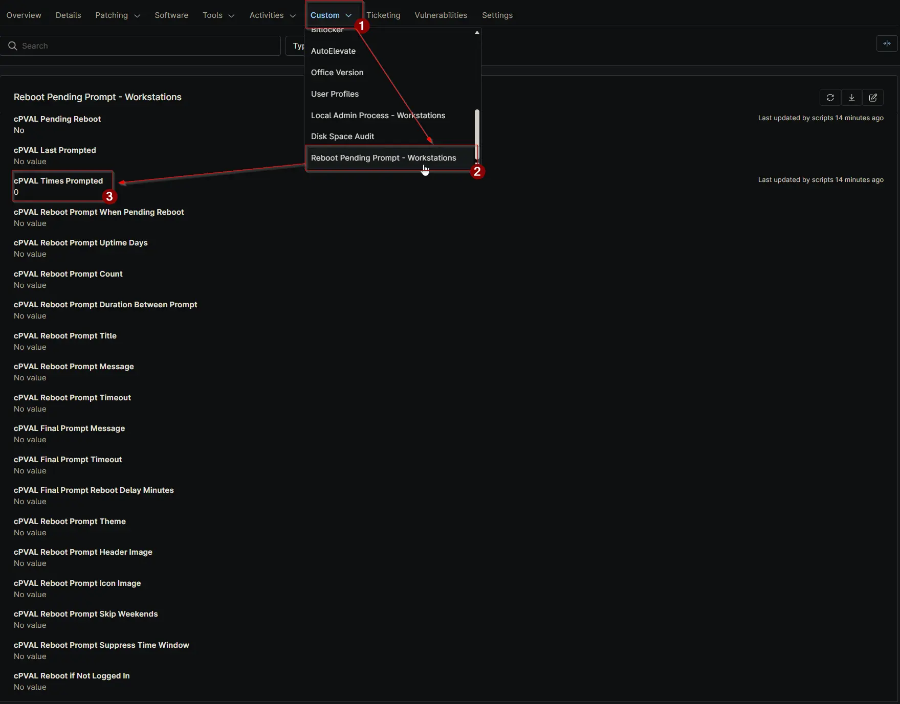

## Summary

Tracks the number of reboot prompts sent to the device. Updated automatically by the script. Manual edits are not recommended.

## Details

| Label | Field Name | Definition Scope | Type | Required | Default Value | Technician Permission | Automation Permission | API Permission | Description | Tool Tip | Footer Text | Org Level Tab | Location Level Tab | Device Level Tab |
| ----- | ---- | ---------------- | ---- | -------- | ------------- | --------------------- | --------------------- | -------------- | ----------- | -------- | ----------- | ----------- | ----------- | ----------- | ----------- |
| cPVAL Times Prompted | cpvalTimesPrompted | Device | Integer | False | | Editable | Read_Write | Read_Write | Tracks the number of reboot prompts sent to the device. Updated automatically by the script. Manual edits are not recommended. | Displays how many times this machine has been prompted for reboot. Script-managed; avoid manual changes. | Used for monitoring prompt frequency. Do not edit manually as it is maintained by automation. | | | Reboot Pending Prompt - Workstations |

## Dependencies

- [Solution: Reboot Pending Prompt](/docs/d7758fa4-9fcc-4259-a7a5-0ca65dda10eb)

## Custom Field Creation

- [Custom Field Configuration](https://github.com/ProVal-Tech/ninjarmm/blob/main/custom-fields/cpval-times-prompted.toml)

## Sample Screenshot

