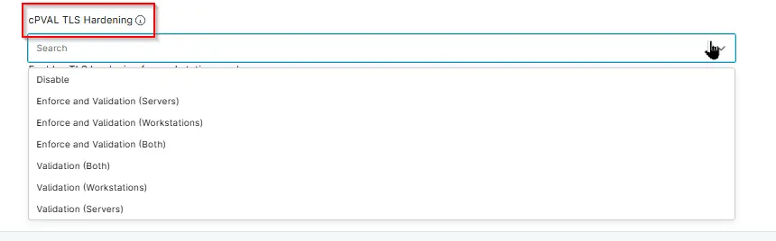

## Summary

Enables TLS hardening for workstations and servers. `Validation` identifies devices that require TLS hardening without making changes. `Enforce` applies hardening to devices flagged by Validation. `Validation` must be enabled for `Enforce` to work properly.

## Details

| Label | Field Name | Definition Scope | Type | Option Value | Required | Default Value | Technician Permission | Automation Permission | API Permission | Description | Tool Tip | Footer Text | Custom Field Tab Name |
| ----- | ---- | ---------------- | ---- | -------- | ------------- | --------------------- | --------------------- | -------------- | ----------- | -------- | ----------- |----------- | ---- | 
| cPVAL TLS Hardening | cpvalTlsHardening | `Organization`, `Location`, `Device` | DropDown | `Validation (Both)`, `Validation (Servers)`, `Validation (Workstations)`,`Disabled`,`Enforce and Validation (Servers)`,`Enforce and Validation (Workstations)`,`Enforce and Validation (Both)` | True | - | Editable | Read/Write | Read/Write | Enables TLS hardening for workstations and servers. `Validation` identifies devices that require TLS hardening without making changes. `Enforce` applies hardening to devices flagged by Validate. `Validation` must be enabled for Enforce to work properly.| Enables TLS hardening for workstations and servers. `Validation` identifies devices that require TLS hardening without making changes. `Enforce` applies hardening to devices flagged by Validate. `Validation` must be enabled for Enforce to work properly. | Enables TLS hardening for workstations and servers. | TLS/SSL |

## Dependencies

- [Solution - TLS/SSL Security Hardening](/docs/5e391e0f-088e-41be-8b6c-306e02a2cadb)

## Custom Field Creation

- [Custom Field Configuration](https://github.com/ProVal-Tech/ninjarmm/blob/main/custom-fields/cpval-tls-hardening.toml)

## Sample Screenshot

## Changelog

###  2026-06-15

- Initial version of the document

