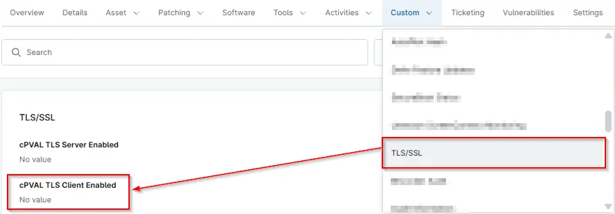

## Summary

This stores the TLS Server enabled.

## Details

| Label | Field Name | Definition Scope | Type | Required | Default Value | Technician Permission | Automation Permission | API Permission | Description | Tool Tip | Footer Text |  Custom Field Tab Name |
| ----- | ---- | ---------------- | ---- | -------- | ------------- | --------------------- | --------------------- | -------------- | ----------- | -------- | ----------- | ----------- |
| cPVAL TLS Server Enabled | cpvalTlsServerEnabled | Device | Text | False |  | Read Only | Read/Write | Read/Write | This stores the TLS Server enabled. |  |  | TLS Audit |

## Dependencies

[Script - TLS Enabled List Audit](/docs/a19fe079-7179-4bdd-9572-248e1a48fb53)
[Solution - Enabled TLS Version Audit](/docs/9882903a-a467-4136-bb9e-7e2c8f25ae01)

## Custom Field Creation

- [Custom Field Configuration](https://github.com/ProVal-Tech/ninjarmm/blob/main/custom-fields/cpval-tls-server-enabled.toml)

## Sample Screenshot

## Changelog

### 2026-04-15

- Initial version of the document
