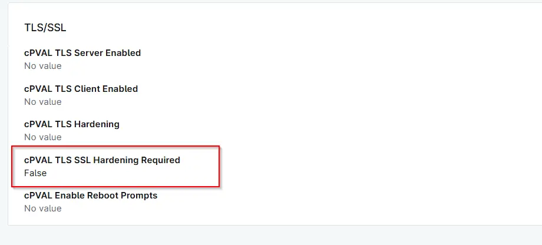

## Summary
This custom field is populated by the [Validate TLS SSL Hardening](/docs/f4505cf9-915f-464f-ab45-95f9eaea7a8d)  and flags devices that require TLS/SSL hardening to meet security best practices.

## Details

| Label | Field Name | Definition Scope | Type | Required | Default Value | Options | Technician Permission | Automation Permission | API Permission | Description | Tool Tip | Footer Text |  Custom Field Tab Name |
| ----- | ---- | ---------------- | ---- | -------- | ------------- | ------------- | --------------------- | --------------------- | -------------- | ----------- | -------- | ----------- | ----------- |
| cPVAL TLS SSL Hardening Required | cpvalTlsSslHardeningRequired | `Device` | Text | False | - | - | Editable | Read_Write | Read_Write | This custom field is populated by the "Validate TLS SSL Hardening" script and flags devices that require TLS/SSL hardening to meet security best practices. | This custom field is populated by the "Validate TLS SSL Hardening" script and flags devices that require TLS/SSL hardening to meet security best practices. | This custom field is populated by the "Validate TLS SSL Hardening" script. | TLS/SSL |

## Dependencies

- [Solution - TLS/SSL Security Hardening](/docs/5e391e0f-088e-41be-8b6c-306e02a2cadb)

## Custom Field Creation

[Custom Field Configuration](https://github.com/ProVal-Tech/ninjarmm/blob/main/custom-fields/cpval-tls-ssl-hardening-required.toml)

## Sample Screenshot

## Changelog

###  2026-06-15

- Initial version of the document
