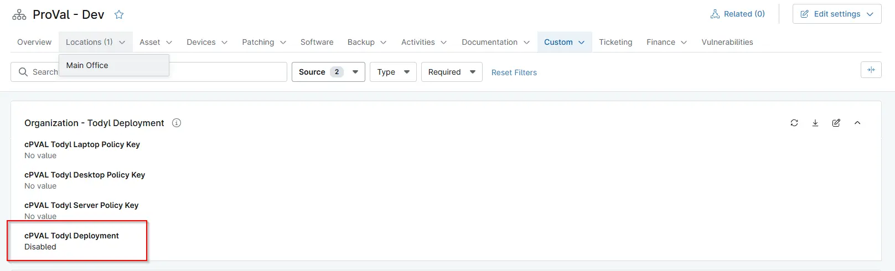

## Summary
Custom Field to install/unintall todyl solution. Select OS to enable auto-deployment of Todyl SGN Connect agent. Select Uninstall to uninstall Todyl if its already installed on the machines.

## Details

| Label | Field Name | Definition Scope | Type | Required | Default Value | Technician Permission | Automation Permission | API Permission | Description | Tool Tip | Footer Text |  Custom Field Tab Name |
| ----- | ---- | ---------------- | ---- | -------- | ------------- | --------------------- | --------------------- | -------------- | ----------- | -------- | ----------- | ----------- |
| cPVAL Todyl Deployment | cpvalTodylDeployment | Organization/Location/Device | drop-down | `Disabled`, `Windows`, `Windows Servers`, `Windows Workstations`, `Uninstall` | `Disabled` | Editable | Read/Write| Read/Write | Select OS to enable auto-deployment of Todyl SGN Connect agent. Select Uninstall to uninstall Todyl if its already installed on the machines.| Select OS to enable auto-deployment of Todyl SGN Connect agent. Select Uninstall to uninstall Todyl if its already installed on the machines. | Select OS to enable auto-deployment of Todyl SGN Connect agent. Select Uninstall to uninstall Todyl if its already installed on the machines. | Todyl Deployment. |

## Dependencies

- [Solution: Todyl Agent Manager](/docs/01e0e3c8-adc5-4035-84d5-9266e5af0760)

## Custom Field Creation

- [Custom Field Configuration](https://github.com/ProVal-Tech/ninjarmm/blob/main/custom-fields/cpval-todyl-deployment.toml)

## Sample Screenshot

## Changelog

### 2026-05-20

- Initial version of the document

