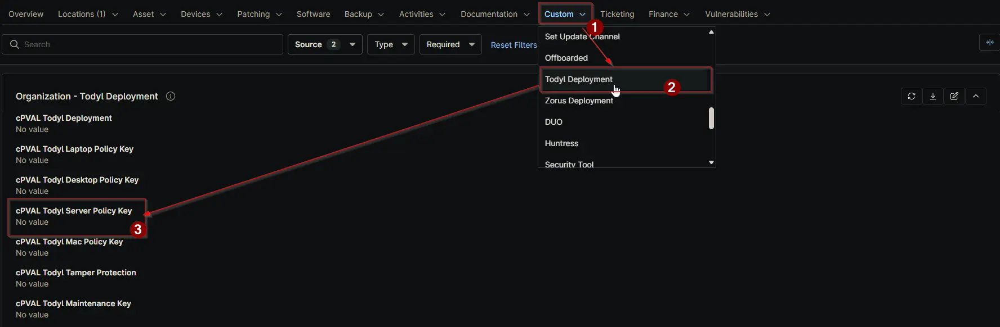

## Summary

Todyl Deployment Key for Servers.

## Details

| Label                         | Field Name                | Definition Scope | Type | Required | Default Value | Technician Permission | Automation Permission | API Permission | Description                       | Tool Tip | Footer Text | Custom Field Tab Name |
| ----------------------------- | ------------------------- | ---------------- | ---- | -------- | ------------- | --------------------- | --------------------- | -------------- | --------------------------------- | -------- | ----------- | --------------------- |
| cPVAL Todyl Server Policy Key | cpvalTodylServerPolicyKey | Organization, Location, Device     | Text | Yes      | -             | Editable              | Read/Write            | Read/Write     | Todyl Deployment Key for Servers. | Provide the Todyl Deployment Key for Servers.      | Provide the Todyl Deployment Key for Servers.        | Todyl Deployment      |

## Dependencies

- [Solution: Todyl Agent Manager](/docs/01e0e3c8-adc5-4035-84d5-9266e5af0760)

## Custom Field Creation

- [Custom Field Configuration](https://github.com/ProVal-Tech/ninjarmm/blob/main/custom-fields/cpval-todyl-server-policy-key.toml)

## Sample Screenshot

## Changelog

### 2026-06-23

- Updated the custom field to support Location and Device

### 2025-08-18

- Initial version of the document

