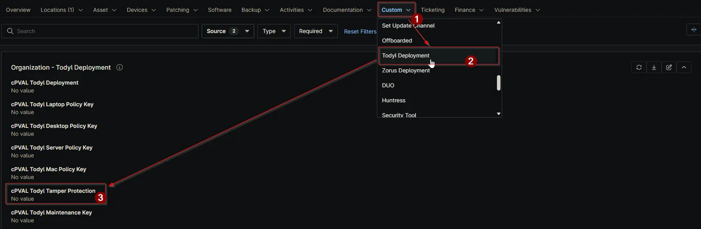

## Summary

Indicates whether the endpoint has Todyl tamper protection enabled. When checked, the script uses the maintenance key for uninstall.

## Details

| Label                         | Field Name                | Definition Scope | Type | Required | Default Value | Technician Permission | Automation Permission | API Permission | Description                       | Tool Tip | Footer Text | Custom Field Tab Name |
| ----------------------------- | ------------------------- | ---------------- | ---- | -------- | ------------- | --------------------- | --------------------- | -------------- | --------------------------------- | -------- | ----------- | --------------------- |
| cPVAL Todyl Tamper Protection | cpvalTodylTamperProtection | Organization, Location, Device    | CheckBox | Yes      |  | Editable | Read/Write  | Read/Write     | Indicates whether the endpoint has Todyl tamper protection enabled. When checked, the script uses the maintenance key for uninstall. | Indicates whether the endpoint has Todyl tamper protection enabled. When checked, the script uses the maintenance key for uninstall. | Indicates whether the endpoint has Todyl tamper protection enabled. When checked, the script uses the maintenance key for uninstall.   | Todyl Deployment      |

## Dependencies

- [Solution: Todyl Agent Manager](/docs/01e0e3c8-adc5-4035-84d5-9266e5af0760)

## Custom Field Creation

- [Custom Field Configuration](https://github.com/ProVal-Tech/ninjarmm/blob/main/custom-fields/cpval-todyl-tamper-protection.toml)

## Sample Screenshot

## Changelog

### 2026-06-23

- Initial version of the document

