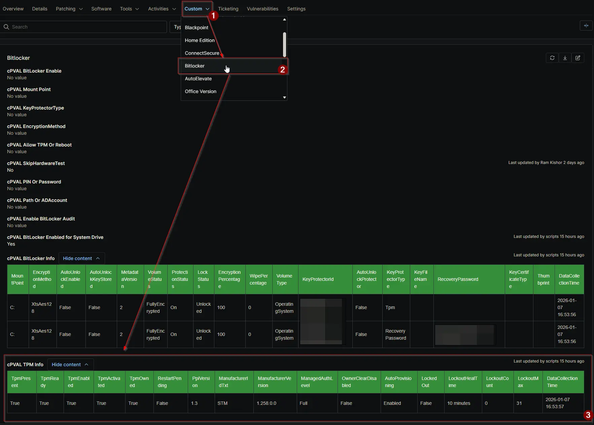

## Summary

Stores a detailed HTML report of the Trusted Platform Module (TPM) status, including Manufacturer, Version, Ready State, and Lockout counters. Populated via automation.

## Details

| Label | Field Name | Definition Scope | Type | Required | Available Options | Technician Permission | Automation Permission | API Permission | Description | Tool Tip | Footer Text | Custom Field Tab Name |
| ----- | ---- | ---------------- | ---- | -------- | ------------- | --------------------- | --------------------- | -------------- | ----------- | -------- | ----------- | ----------- |
| cPVAL TPM Info | cpvalTpmInfo | `Devices` | WYSIWYG | `False` | | Editable | Read_Write | Read_Write | Stores a detailed HTML report of the Trusted Platform Module (TPM) status, including Manufacturer, Version, Ready State, and Lockout counters. Populated via automation. | Auto-populated HTML table displaying TPM hardware specifications and status. | Read-only. Updated automatically by the [BitLocker and TPM Audit](/docs/2d104874-ec69-4d95-b912-7fcd240bf592) script. | BitLocker |

## Dependencies

- [Automation: BitLocker and TPM Audit](/docs/2d104874-ec69-4d95-b912-7fcd240bf592)
- [Solution: BitLocker and TPM Audit](/docs/57c787ad-8d22-4ae4-b5e5-dac34fc600fc)

## cPVAL TPM Info

| Column Name | Description |
| --- | --- |
| TpmPresent | Boolean indicating if a TPM is physically detected on the system. |
| TpmReady | Boolean indicating if the TPM is ready for use by the OS. |
| TpmEnabled | Boolean indicating if the TPM is enabled in BIOS/UEFI. |
| TpmActivated | Boolean indicating if the TPM is activated (TPM 1.2 specific). |
| TpmOwned | Boolean indicating if the TPM has an owner. |
| RestartPending | Boolean indicating if a system restart is pending for TPM operations. |
| PpiVersion | The version of the Physical Presence Interface supported. |
| ManufacturerIdTxt | The readable text name of the TPM manufacturer. |
| ManufacturerVersion | The version string of the TPM firmware. |
| ManagedAuthLevel | The level of management authorization available to the OS. |
| OwnerClearDisabled | Boolean indicating if clearing the TPM owner is disabled by policy. |
| AutoProvisioning | Indicates if the OS is configured to automatically provision the TPM. |
| LockedOut | Boolean indicating if the TPM is currently locked out. |
| LockoutHealTime | The time remaining before the lockout counter decrements. |
| LockoutCount | The current number of failed authorization attempts. |
| LockoutMax | The maximum number of failed attempts allowed before lockout. |
| DataCollectionTime | The timestamp when the audit was performed. |

## Custom Field Creation

[Custom Field Configuration](https://github.com/ProVal-Tech/ninjarmm/blob/main/custom-fields/cpval-tpm-info.toml)

## Sample Screenshot

