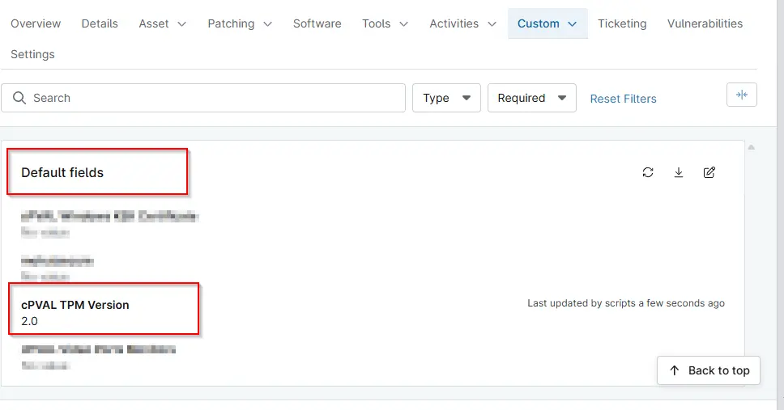

## Summary

Displays the enabled TPM version for the device. The data is collected and stored by the `Get TPM Version` script.

## Details

| Label | Field Name | Definition Scope | Type | Required | Default Value | Technician Permission | Automation Permission | API Permission | Description | Tool Tip | Footer Text |  Custom Field Tab Name |
| ----- | ---- | ---------------- | ---- | -------- | ------------- | --------------------- | --------------------- | -------------- | ----------- | -------- | ----------- | ----------- |
| cPVAL TPM Version | cpvalTpmVersion |  Device | Text | False | | Read Only | Read/Write | Read/Write | Displays the enabled TPM version for the device. The data is collected and stored by the `Get TPM Version` script. |Displays the enabled TPM version for the device. | Displays the enabled TPM version for the device. | Default |

## Dependencies

- [Solution: TPM Version Audit](/docs/862f9638-4600-46c2-8894-af488273c1c7)

## Custom Field Creation

- [Custom Field Configuration](https://github.com/ProVal-Tech/ninjarmm/blob/main/custom-fields/cpval-tpm-version.toml)

## Sample Screenshot

## Changelog

### 2026-03-12

- Initial version of the document

