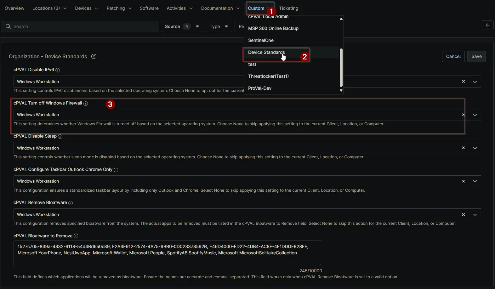

## Summary

This custom field determines whether Windows Firewall is turned off based on the selected operating system. Choose None to skip applying this setting to the current Client, Location, or Computer.

## Details

| Label | Field Name | Definition Scope | Type | Required | Default Value | Available Options | Technician Permission | Automation Permission | API Permission | Description | Tool Tip | Footer Text | Custom Field Tab Name |
| ----- | ---- | ---------------- | ---- | -------- | ------------- | --------------------- | --------------------- | -------------- | ----------- | -------- | ----------- | ----------- | ----------- |
| cPVAL Turn off Windows Firewall | cpvalTurnoffWindowsFirewall | `Organization`, `Location`, `Device` | Drop-down | False | | `None`, `Windows Workstation and Windows Server`, `Windows Workstation`, `Windows Server` | Editable | Read_Write | Read_Write | Select the operating system(s) for which the Windows Firewall should be turned off. Choose None to exclude the Client, Location, or Computer from this action. | Use this dropdown to specify the OS where Windows Firewall should be disabled. Selecting None will leave the firewall settings unchanged for the selected entity. | This setting determines whether Windows Firewall is turned off based on the selected operating system. Choose None to skip applying this setting to the current Client, Location, or Computer. | Device Standards |

## Dependencies

- [Solution - Turn off Windows Firewall](/docs/202f2907-e8e5-4d65-9823-e70749cef708)
- [Solution - Device Standards](/docs/a0c383d4-699a-4bb8-af7f-c2a007747182)

## Custom Field Creation

[Custom Field Configuration](https://github.com/ProVal-Tech/ninjarmm/blob/main/custom-fields/cpval-turn-off-windows-firewall.toml)

## Sample Screenshot

