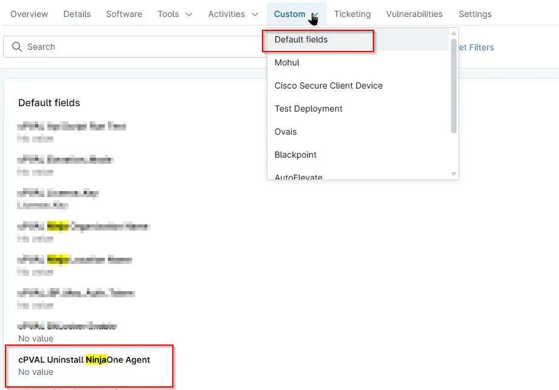

## Summary
This custom field is populated by the “Uninstall NinjaOne Agent” script after the agent has been removed, providing confirmation that the uninstall process completed successfully.

## Details

| Label                          | Field Name                     | Definition Scope | Type  | Required | Default Value | Technician Permission | Automation Permission | API Permission | Description                                                                                                                                 | Tool Tip                                               | Footer Text                                                                                                                                 | Custom Field Tab Name |
|--------------------------------|--------------------------------|------------------|-------|----------|----------------|-----------------------|----------------------|----------------|---------------------------------------------------------------------------------------------------------------------------------------------|-------------------------------------------------------|---------------------------------------------------------------------------------------------------------------------------------------------|-----------------------|
| cPVAL Uninstall NinjaOne Agent | cpvalUninstallNinjaoneAgent   | Device           | Text  | False    |                | Editable              | Read/Write          | Read/Write     | This custom field is populated by the “Uninstall NinjaOne Agent” script after the agent has been removed, providing confirmation that the uninstall process completed successfully. | This Custom Field is to be filled by “Uninstall NinjaOne Agent” script only | This custom field is populated by the “Uninstall NinjaOne Agent” script after the agent has been removed, providing confirmation that the uninstall process completed successfully. | Default Fields       |

## Dependencies
 - [Script : Uninstall NinjaOne Agent](/docs/1efc6b0c-bfd0-4d80-b4c5-e32defa31bc6) 
 - [Solution : Uninstall Ninja RMM Agent ](/docs/28bf69eb-dfb9-42c7-9ea8-7f906551da9c) 

## Custom Field Creation

[Custom Field Configuration](https://github.com/ProVal-Tech/ninjarmm/blob/main/custom-fields/cpval-uninstall-ninjaone-agent.toml)

## Sample Screenshot

