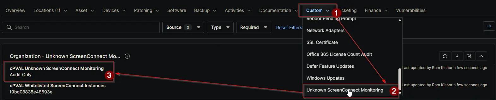

## Summary

This custom field controls how NinjaOne handles unknown or non-approved ScreenConnect installs on a device.

- **Audit Only:** Checks for ScreenConnect installs and updates custom fields. No alerts and no removal.
- **Audit and Alert:** Checks and updates custom fields, then creates alert/ticket output when unknown installs are found.
- **Autofix and Alert on Failure:** Tries to remove unknown installs, checks again, updates custom fields, and alerts only if unknown installs still remain.

> **Note:** *This custom field must be set to enable the solution's automated execution. Even so, related automations can still run, and if no drop-down value is selected on a device, they default to `Audit` mode.*

## Details

| Label | Field Name | Definition Scope | Type | Required | Default Value | Available Options | Technician Permission | Automation Permission | API Permission | Description | Tool Tip | Footer Text | Custom Field Tab Name |
| ----- | ---- | ---------------- | ---- | -------- | ------------- | --------------------- | --------------------- | -------------- | ----------- | -------- | ----------- | ----------- | ----------- |
| `cPVAL Unknown ScreenConnect Monitoring` | `cpvalUnknownScreenconnectMonitoring` | `Organization`, `Location`, `Device` | `Drop-down` | `False` | `Audit Only` | <ul><li>`Audit Only`</li><li>`Audit and Alert`</li><li>`Autofix and Alert on Failure` | `Editable` | `Read_Write` | `Read_Write` | `Controls how unknown or non-approved ScreenConnect instances are handled. Choose to audit only, audit and alert, or attempt removal and alert on failures. Results are written to device-level custom fields and tickets when applicable.` | `Select the enforcement level for detecting non-whitelisted ScreenConnect installs. Options range from visibility only to alerting and attempted removal with failure reporting.` | `Stricter options may attempt automated removals and generate alerts or tickets. Verify ScreenConnect allowlist before enabling Autofix.` | `Unknown ScreenConnect Monitoring` |

### Monitoring Modes

| Mode                             | Behavior |
|----------------------------------|----------|
| `Audit Only`                       | `Audits installed ScreenConnect instances, updates WYSIWYG and checkbox fields, no remediation, no alert failure exit.` |
| `Audit and Alert`                  | `Audits and updates custom fields, returns alert output and non-zero exit when unknown instances are detected.` |
| `Autofix and Alert on Failure`     | `Attempts uninstall of unknown instances, performs post-remediation re-audit, updates custom fields, alerts only if unknown instances remain.` |

## Dependencies

- [Solution: Unknown ScreenConnect Monitoring](/docs/b3bbf754-fbdc-4034-8728-c52286746b1f)

## Custom Field Creation

- [Custom Field Configuration](https://github.com/ProVal-Tech/ninjarmm/blob/main/custom-fields/cpval-unknonwn-screenconnect-monitoring.toml)

## Sample Screenshot

## Changelog

### 2026-04-09

- Initial version of the document
