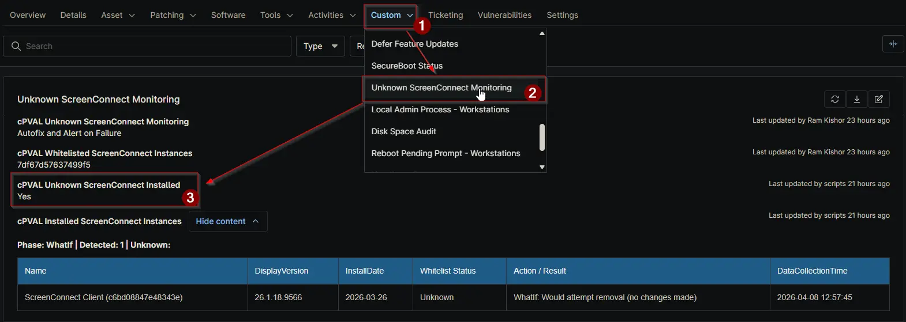

## Summary

This device-level checkbox shows whether any unknown ScreenConnect instance was found in the latest monitoring run.

The automation sets this field to **True** when it detects one or more ScreenConnect instances that are not listed in [cPVAL Whitelisted ScreenConnect Instances](/docs/b190f460-afd9-4761-ad30-93094d15be2b). If all detected instances are approved, the field is set to **False**.

Use this field for quick filtering, reporting, and alert logic. It shows only the most recent scan result and is recalculated on every run, so manual changes are not recommended because they will be overwritten.

## Details

| Label | Field Name | Definition Scope | Type | Required | Default Value | Example | Technician Permission | Automation Permission | API Permission | Description | Tool Tip | Footer Text | Custom Field Tab Name |
| ----- | ---- | ---------------- | ---- | -------- | ------------- | --------------------- | --------------------- | -------------- | ----------- | -------- | ----------- | ----------- | ----------- |
| `cPVAL Unknown ScreenConnect Installed` | `cpvalInstalledScreenconnectInstances` | `Device` | `Checkbox` | `False` | | | `Editable` | `Read_Write` | `Read_Write` | `Indicates whether one or more non-whitelisted ScreenConnect instances were detected on the device during the latest monitoring run.` | `Automatically checked when the monitoring script detects any ScreenConnect instance not listed in the approved whitelist.` | `This flag is set and cleared automatically by detection logic. Manual changes may be overwritten.` | `Unknown ScreenConnect Monitoring` |

## Dependencies

- [Custom Field: cPVAL Unknown ScreenConnect Monitoring](/docs/ce85f694-4518-4e46-93e2-b008210e9627)
- [Custom Field: cPVAL Whitelisted ScreenConnect Instances](/docs/b190f460-afd9-4761-ad30-93094d15be2b)
- [Solution: Unknown ScreenConnect Monitoring](/docs/b3bbf754-fbdc-4034-8728-c52286746b1f)

## Custom Field Creation

- [Custom Field Configuration](https://github.com/ProVal-Tech/ninjarmm/blob/main/custom-fields/cpval-unknown-screenconnect-installed.toml)

## Sample Screenshot

## Changelog

### 2026-04-09

- Initial version of the document
