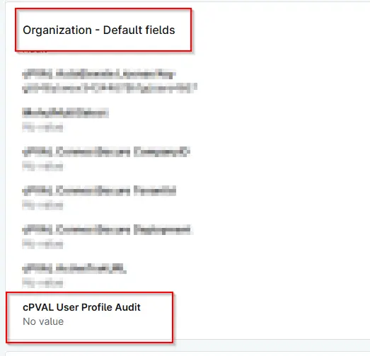

## Summary
Use this field to specify which operating system should receive User Profile Audit automatically.

## Details

| Label | Field Name | Definition Scope | Type | Required | Default Value | Technician Permission | Automation Permission | API Permission | Description | Tool Tip | Footer Text |  Custom Field Tab Name |
| ----- | ---- | ---------------- | ---- | -------- | ------------- | --------------------- | --------------------- | -------------- | ----------- | -------- | ----------- | ----------- |
| cPVAL User Profile Audit | cpvalUserProfileAudit | Organization/Device/Location| Drop-down | False | | `Editable` | `Read/Write` | `Read/Write`| Use this field to specify which operating system should receive User Profile Audit automatically. If you select “Disable,” the deployment will not occur for this configuration level. | Select the operating system for User Profile Audit. Choose “Disable” to exclude deployment at this level. | Tip: Selecting “Disable” overrides auto deployment for the chosen level. Ensure other levels are configured as needed.| Default | 

## Dependencies
- [Solution - User Profile - Get Information](/docs/04dfa2f0-b1e0-4860-b7be-39b841a7e492)

## Custom Field Creation

- [Custom Field Configuration](https://github.com/ProVal-Tech/ninjarmm/blob/main/custom-fields/cpval-user-profile-audit.toml)

## Sample Screenshot

