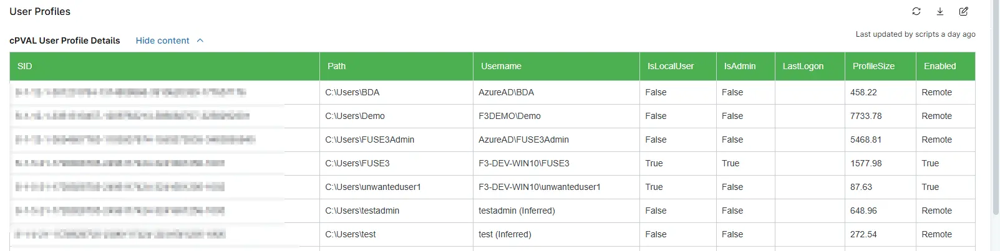

## Summary
Stores an HTML-formatted information of User Profiles. Data is populated via the "User Profile - Audit" automation script

## Details

| Label | Field Name | Definition Scope | Type | Required | Default Value | Technician Permission | Automation Permission | API Permission | Description | Tool Tip | Footer Text |  Custom Field Tab Name |
| ----- | ---- | ---------------- | ---- | -------- | ------------- | --------------------- | --------------------- | -------------- | ----------- | -------- | ----------- | ----------- |
| cPVAL User Profile Details | cpvalUserProfileDetails | Device | WYSIWYG | False | | Editable | Read_Write | Read_Write | Stores an HTML-formatted information of User Profiles. Data is populated via the "User Profile - Audit" automation script | Displays the information about user profiles. | Displays the information about user profiles. | User Profiles |

## Dependencies
- [Automations - User Profile - Audit](/docs/97da597d-fd40-40f3-994c-d1f302ac884d)
- [Solution - User Profile - Get Information](/docs/04dfa2f0-b1e0-4860-b7be-39b841a7e492)

## Custom Field Creation

- [Custom Field Configuration](https://github.com/ProVal-Tech/ninjarmm/blob/main/custom-fields/cpval-user-profile-details.toml)

## Sample Screenshot

