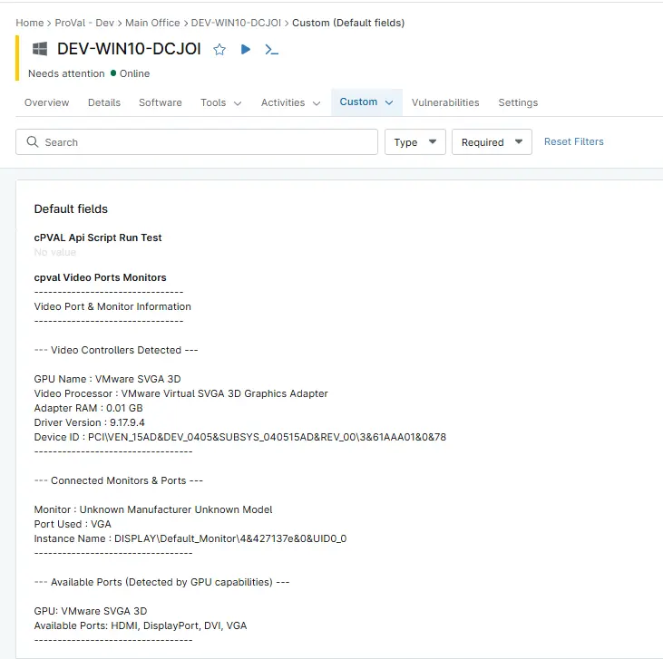

## Summary

Displays detailed information gathered by the script [Video Ports and Monitor Usage Detection](/docs/1778ced7-a9b2-461c-a20c-c72c2242e94f). It displays data about the system’s video controllers, shows which monitors are currently connected, type of video ports they are using and commonly available ports based on GPU capabilities.

## Details

| Label | Field Name | Definition Scope | Type | Required | Default Value | Technician Permission | Automation Permission | API Permission | Description | Tool Tip | Footer Text |
| ----- | ---- | ---------------- | ---- | -------- | ------------- | --------------------- | --------------------- | -------------- | ----------- | -------- | ----------- |
|cPVAL Video Ports Monitors | cpvalvideoportsmonitors | Device | multi-line | False | | `Editable` | `Read/Write` | `Read/Write` | Displays data about the system’s video controllers, shows which monitors are currently connected, type of video ports they are using and commonly available ports based on GPU capabilities. | Video Ports | Video Ports |

## Dependencies

- [Video Port and Monitor Usage Detection](/docs/1778ced7-a9b2-461c-a20c-c72c2242e94f)

## Custom Field Creation

- [Custom Field Configuration](https://github.com/ProVal-Tech/ninjarmm/blob/main/custom-fields/cpval-video-ports-monitors.toml)

## Sample Screenshot

