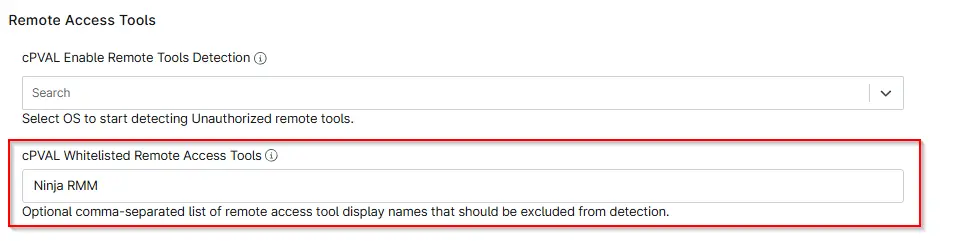

## Summary

Custom filed to define an optional comma-separated list of remote access tool display names to exclude from detection. Whitelisting follows a hierarchical override order: Device-level entries take precedence over Location-level entries, and Location-level entries take precedence over Client-level entries.

## Details

| Label | Field Name | Definition Scope | Type | Required | Default Value | Technician Permission | Automation Permission | API Permission |  Custom Field Tab Name |
| ----- | ---- | ---------------- | ---- | -------- | ------------- | --------------------- | --------------------- | -------------- | ----------- | 
|cPVAL Whitelisted Remote Access Tools|cpvalWhitelistedRemoteAccessTools|`Organization`, `Location`, `Device`|Text|False|-| Editable | Read/Write | Read/Write | Remote Access Tools |

## Dependencies

- [Solution - Installed Remote Access Tool Audit](/docs/eae2fab9-4697-4e1e-ad8f-93f8a09d7056)

## Custom Field Creation

- [Custom Field Configuration](https://github.com/ProVal-Tech/ninjarmm/blob/main/custom-fields/cpval-whitelisted-remote-access-tools.toml)

## Sample Screenshot

## Changelog

### 2026-06-24

- Initial version of the document