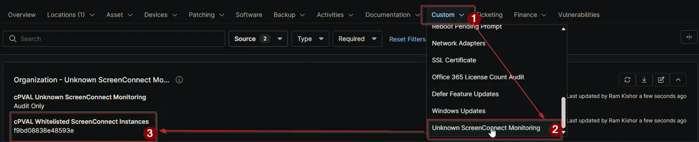

## Summary

This custom field lists which ScreenConnect instances are approved for an organization, location, or device.

The monitoring automation checks installed ScreenConnect instances against this list. Any instance not in the list is treated as unapproved and handled by the mode set in [cPVAL Unknown ScreenConnect Monitoring](/docs/ce85f694-4518-4e46-93e2-b008210e9627) custom-field.

> **Note:** *If this field is left blank, no ScreenConnect instances are considered approved. In that case, `Audit Only` reports all instances as unapproved, `Audit and Alert` generates ticket output for all instances, and `Autofix and Alert on Failure` attempts to remove all detected instances.*

**Set this field carefully before enabling Autofix to avoid removing valid internal or support ScreenConnect instances.**

## Details

| Label | Field Name | Definition Scope | Type | Required | Default Value | Example | Technician Permission | Automation Permission | API Permission | Description | Tool Tip | Footer Text | Custom Field Tab Name |
| ----- | ---- | ---------------- | ---- | -------- | ------------- | --------------------- | --------------------- | -------------- | ----------- | -------- | ----------- | ----------- | ----------- |
| `cPVAL Whitelisted ScreenConnect Instances` | `cpvalWhitelistedScreenconnectInstances` | `Organization`, `Location`, `Device` | `Text` | `False` | | `f9bd08838e48593e, 9cf67d59637466e5` | `Editable` | `Read_Write` | `Read_Write` | `Defines approved ScreenConnect instances allowed on the device. Any instance not listed here is treated as non-approved and subject to auditing, alerting, or removal based on monitoring configuration.` | `Enter approved ScreenConnect instance identifiers. If left blank, all detected ScreenConnect instances are considered non-whitelisted.` | `Leaving this field empty will treat all ScreenConnect installs as unauthorized. When Autofix is enabled, all instances may be removed.` | `Unknown ScreenConnect Monitoring` |

## Dependencies

- [Custom Field: cPVAL Unknown ScreenConnect Monitoring](/docs/ce85f694-4518-4e46-93e2-b008210e9627)
- [Solution: Unknown ScreenConnect Monitoring](/docs/b3bbf754-fbdc-4034-8728-c52286746b1f)

## Custom Field Creation

- [Custom Field Configuration](https://github.com/ProVal-Tech/ninjarmm/blob/main/custom-fields/cpval-whitelisted-screenconnect-instances.toml)

## Sample Screenshot

## Changelog

### 2026-04-09

- Initial version of the document
