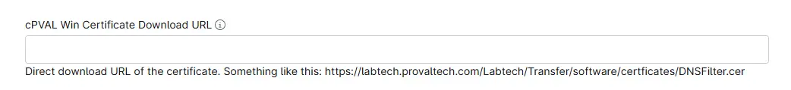

## Summary
Custom Field to add direct download URL of the certificate. Something like this: https://example.com/certficates/DNSFilter.cer 

## Details

| Label | Field Name | Definition Scope | Type | Required | Default Value | Technician Permission | Automation Permission | API Permission | Custom Field Tab Name |
| ----- | ----- | ----- | ----- | ----- | ----- | ----- | ----- | ----- | ----- | 
| cPVAL Win Certificate Download URL | cpvalWinCertificateDownloadUrl |  `Organization`, `Location`, `Device`  | Text | False | | Read Only | Read/Write | Read/Write | Install Certificate |

## Dependencies

- [Solution - Install Certificates - Windows/Mac](/docs/12034de3-aa3a-4f6c-89da-a6f229e6fbec)

## Custom Field Creation

- [Custom Field Configuration](https://github.com/ProVal-Tech/ninjarmm/blob/main/custom-fields/cpval-win-certificate-download-url.toml)

## Sample Screenshot

## Changelog

### 2026-09-28

- Initial version of the document