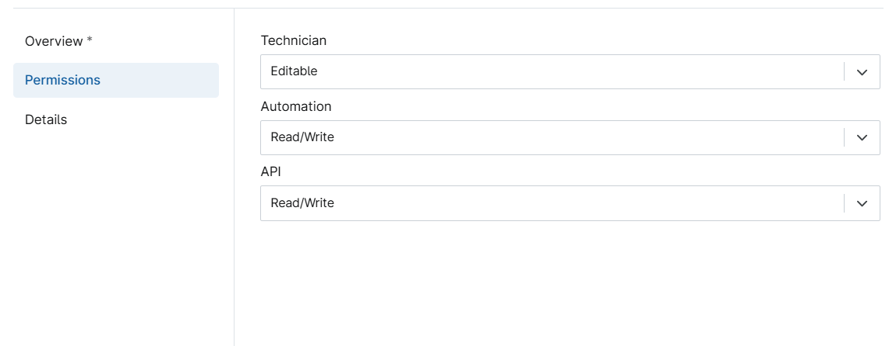

## Summary

This custom field stores the Windows 11 Compatibility result gathered by script [Windows 11 Compatibility](/docs/fd6f7153-0a36-4a0b-a46d-ce403f13a540). The data it stores as (Capable, Not Capable, or Undetermined).

## Details

| **Label**                     | **Field Name**     | **Definition Scope**           | **Type** | **Required** | **Default Value** | **Technician Permission** | **Automation Permission** | **API Permission** | **Description** | **Tool Tip** | **Footer Text** |
|------------------------------|--------------------|-------------------------------|----------|--------------|-------------------|----------------------------|----------------------------|--------------------|----------------|-------------|-----------------|
| cPVAL Win 11 Compatibility   | cpvalWin11Compat   | Device Location Organization  | Text     | True         |                   | Editable                   | Read/Write                 | Read/Write         |                |             |                 |

## Dependencies

[Windows 11 Compatibility](/docs/fd6f7153-0a36-4a0b-a46d-ce403f13a540)

## Custom Field Creation

### Step 1

Navigate to the `Administration` menu, then proceed to `Devices` and select `Global Custom Fields`.  

### Step 2

Locate the `Add` button on the right-hand side of the screen and click on it.  
  

### Step 3

After clicking the `Add` button, select the `Field` button that appears.  

The following Pop-up screen will appear:  

From the drop down select the `Text` custom field type

The fill the required field as provided:

Once created it will look like this:

