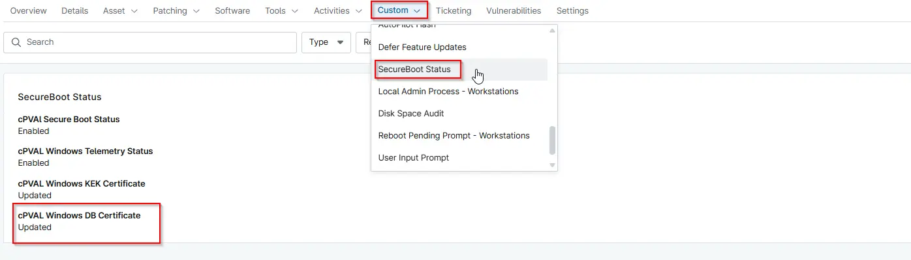

## Summary

This custom field shows the status of the Windows Secure Boot Database (DB) certificate.

## Details

| Label | Field Name | Definition Scope | Type | Required | Default Value | Technician Permission | Automation Permission | API Permission | Description | Tool Tip | Footer Text | Custom Field Tab Name |
| ----- | ---- | ---------------- | ---- | -------- | ------------- | --------------------- | --------------------- | -------------- | ----------- | -------- | ----------- | ----------- |
| cpvalWindowsDbCertificate | cPVAL Windows DB Certificate | `Device` | `Text` | False | -- | `Editable` | `Read/Write` | `Read/Write` | This custom field shows the status of the Windows Secure Boot Database (DB) certificate. | Indicates whether the DB certificate is valid and trusted. | Ensures system integrity and secure boot validation. | SecureBoot Audit |

## Dependencies

[Automation - SecureBoot Compliance - Audit](/docs/33446436-a337-411d-99ae-299046ba30d9)
[Solution - Secure Boot Compliance Audit](/docs/b037020a-1af5-4ecb-bb6b-62d59c123937)

## Custom Field Creation

- [Custom Field Configuration](https://github.com/ProVal-Tech/ninjarmm/blob/main/custom-fields/cpval-windows-db-certificate.toml)

## Sample Screenshot

## Changelog

Initial Version
