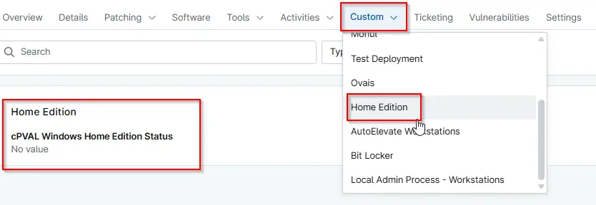

## Summary

This custom field checks the OS Caption value to determine whether the installed Windows operating system is a home edition. It displays True if the OS name contains Home otherwise it displays False.

## Details

| Label | Field Name | Definition Scope | Type | Required | Default Value | Technician Permission | Automation Permission | API Permission | Description | Tool Tip | Footer Text |  Custom Field Tab Name |
| ----- | ---- | ---------------- | ---- | -------- | ------------- | --------------------- | --------------------- | -------------- | ----------- | -------- | ----------- | ----------- |
| cPVAL Windows Home Edition Status | cpvalWindowsHomeEditionStatus | `Device`  | Text | No      | -    | Editable       | Read/Write  | Read/Write  | This custom field checks the OS Caption value to determine whether the installed Windows operating system is a home edition. It displays True if the OS name contains Home otherwise it displays False.  | Identifies whether the device is running Windows home edition. Displays True or False.  | Identifies whether the device is running Windows home edition. Displays True or False.  | `Home Edition` |

## Dependencies

- [Automation - Check Windows Home Edition Status](/docs/ffef0ee2-6b6c-43df-ab5a-ef2dbc702325)

## Custom Field Creation

[Custom Field Configuration](https://github.com/ProVal-Tech/ninjarmm/blob/main/custom-fields/check-windows-home-edition-status.toml)

## Sample Screenshot

