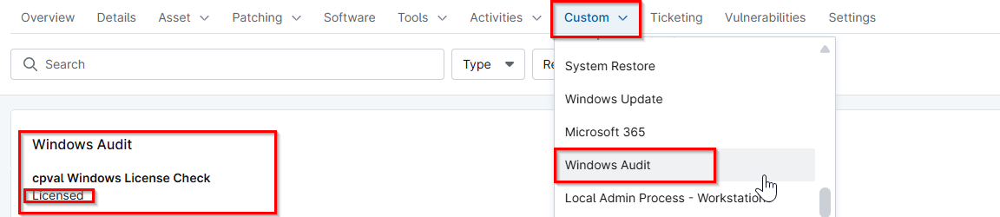

## Summary
This stores the Windows License Status of the Windows machine.

## Details

| Label | Field Name | Definition Scope | Type | Required | Default Value | Technician Permission | Automation Permission | API Permission | Description | Tool Tip | Footer Text |  Custom Field Tab Name |
| ----- | ---- | ---------------- | ---- | -------- | ------------- | --------------------- | --------------------- | -------------- | ----------- | -------- | ----------- | ----------- |
| cpval Windows License Check | cpvalWindowsLicenseCheck | `Device` | Text | False |  | Read Only | Read/Write | Read/Write | This stores the Windows License Status of the Windows machine. | This stores the Windows License Status of the Windows machine. | This stores the Windows License Status of the Windows machine. | Windows Audit |

## Dependencies

- [Solution - Windows License Status](/docs/e05c7729-ebb0-4818-a3a9-b8f736c46c23)

## Custom Field Creation

- [Custom Field Configuration](https://github.com/ProVal-Tech/ninjarmm/blob/main/custom-fields/cpval-windows-license-check.toml)

## Sample Screenshot

## Changelog

### 2026-05-08

- Initial version of the document