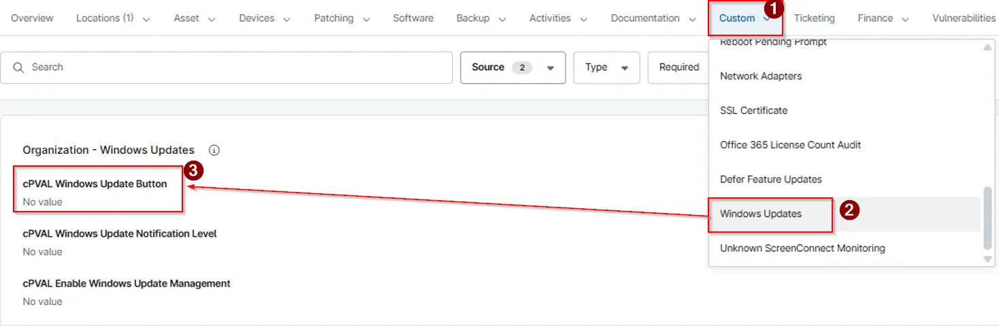

## Summary

This Custom field provides the option to "Enable" or "Disable" the Windows Update (Check for Updates).

## Details

| Label | Field Name | Definition Scope | Type | Required | Option Value | Default Value | Technician Permission | Automation Permission | API Permission | Description | Tool Tip | Footer Text |  Custom Field Tab Name |
| ----- | ---- | ---------------- | ---- | -------- | ------------ | ------------- | --------------------- | --------------------- | -------------- | ----------- | -------- | ----------- | ----------- |
| cPVAL Windows Update Button | cpvalWindowsUpdateButton | Organization , Location, Device | DropDown | False  | Enable, Disable |  | Editable | Read/Write | Read/Write | This Custom field provides the option to `Enable` or `Disable` the Windows Update (Check for Updates). |This Custom field provides the option to `Enable` or `Disable` the Windows Update (Check for Updates). | This Custom field provides the option to `Enable` or `Disable` the Windows Update (Check for Updates). |Windows Updates  |

## Dependencies

- [Script - Windows Updates - Enable or Disable Settings](/docs/c988cacf-1964-4c9b-8a9f-bb6b43c283cb)
- [Solution - Windows Update UI Enable-Disable](/docs/a6da0735-ac80-40f8-8ad3-375ffa8d0e93)

## Custom Field Creation

- [Custom Field Configuration](https://github.com/ProVal-Tech/ninjarmm/blob/main/custom-fields/cpval-windows-update-button.toml)

## Sample Screenshot

## Changelog

### 2026-04-22

- Initial version of the document