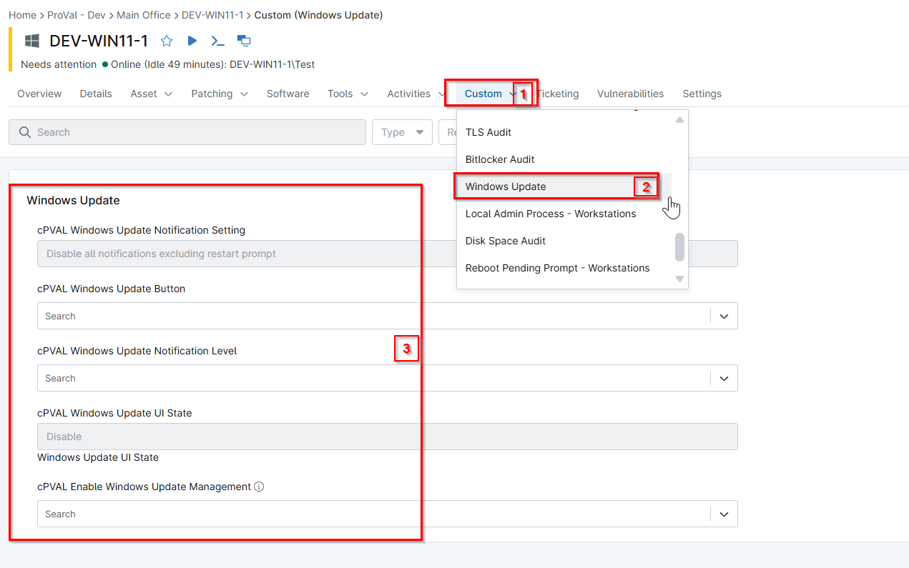

## Summary

This stores the Windows Update (Check for Updates) notification level state.

## Details

| Label | Field Name | Definition Scope | Type | Required | Default Value | Technician Permission | Automation Permission | API Permission | Description | Tool Tip | Footer Text |  Custom Field Tab Name |
| ----- | ---- | ---------------- | ---- | -------- | ------------- | --------------------- | --------------------- | -------------- | ----------- | -------- | ----------- | ----------- |
| cPVAL Windows Update Notification Setting | cpvalWindowsUpdateNotificationSetting | Device | Text | False  |  | Editable | Read/Write | Read/Write | This stores the Windows Update (Check for Updates) notification level state. |  |  | Windows Updates |

## Dependencies

- [Script - Windows Updates - Enable or Disable Settings](/docs/c988cacf-1964-4c9b-8a9f-bb6b43c283cb)
- [Solution - Windows Update UI Enable-Disable](/docs/a6da0735-ac80-40f8-8ad3-375ffa8d0e93)

## Sample Screenshot

## Changelog

### 2026-04-16

- Removed unnecessary auditing solution, that contains multiple groups, custom fields, and complicated compound conditions.

### 2026-04-08

- Initial version of the document