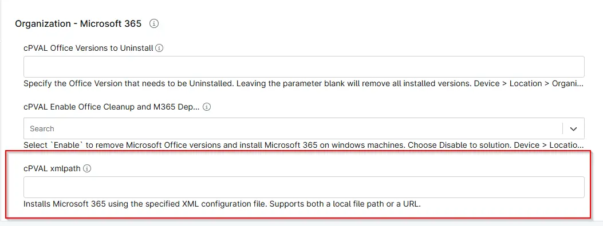

## Summary
Custom Field to specify XML file to be used for Microsoft 365 installation. If this custom field is blank on all device, location and Organization level, [Script - Office Cleanup and M365 Deployment](/docs/de0e7e1f-6f29-41b2-9d65-164b2e2c4431) will use the script parameter `XMLPath`. And if it is also blank, script will use the default configuration.

## Details

| Label | Field Name | Definition Scope | Type | Required | Default Value | Technician Permission | Automation Permission | API Permission | Description | Tool Tip | Footer Text |  Custom Field Tab Name |
| ----- | ---- | ---------------- | ---- | -------- | ------------- | --------------------- | --------------------- | -------------- | ----------- | -------- | ----------- | ----------- |
| cPVAl Xmlpath | cpvalXmlpath | Device/Location/Organization | Text | False | - | Editable | Read_Write | Read_Write | Installs Microsoft 365 using an XML file (local or URL). If none is provided, Office Cleanup and M365 Deployment uses a parameter-defined or default configuration. Device > Location > Organization in precedence. | Installs Microsoft 365 using the specified XML configuration file. Supports both a local file path or a URL. |Installs Microsoft 365 using the specified XML configuration file. Supports both a local file path or a URL.| Microsoft 365 |

## Dependencies

- [Solution: Office Cleanup and M365 Deployment](/docs/f5efe485-4c55-4fe0-88db-05c06305b101)

## Custom Field Creation

- [Custom Field Configuration](https://github.com/ProVal-Tech/ninjarmm/blob/main/custom-fields/cpval-xmlpath.toml)

## Sample Screenshot

## Changelog

### 2026-30-04

- Initial version of the document