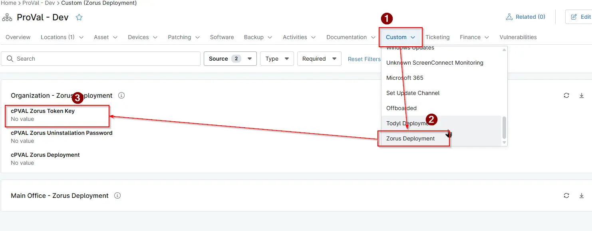

## Summary
Deployment token generated within the Zorus portal for deploying the Zorus agent.

## Details

| Label                 | Field Name         | Definition Scope | Type | Required | Default Value | Technician Permission | Automation Permission | API Permission | Description                                                                        | Tool Tip | Footer Text | Custom Field Tab Name |
| --------------------- | ------------------ | ---------------- | ---- | -------- | ------------- | --------------------- | --------------------- | -------------- | ---------------------------------------------------------------------------------- | -------- | ----------- | --------------------- |
| cPVAL Zorus Token Key | cpvalZorusTokenKey | Organization     | Text | Yes      | -             | Editable              | Read/Write            | Read/Write     | Deployment token generated within the Zorus portal, for deploying the Zorus agent. | -        | -           | Zorus Deployment      |

## Dependencies

- [Zorus Deployment](/docs/da444ba9-ae51-48f8-8913-35f206579b04)
- [Solution: Zorus Agent Manager](/docs/3b1dee7b-3bbb-4122-b33c-da6caa2a2d56)

## Custom Field Creation

- [Custom Field Configuration](https://github.com/ProVal-Tech/ninjarmm/blob/main/custom-fields/cpval-zorus-token-key.toml)

## Sample Screenshot

## Changelog

### 2025-08-18

- Initial version of the document
