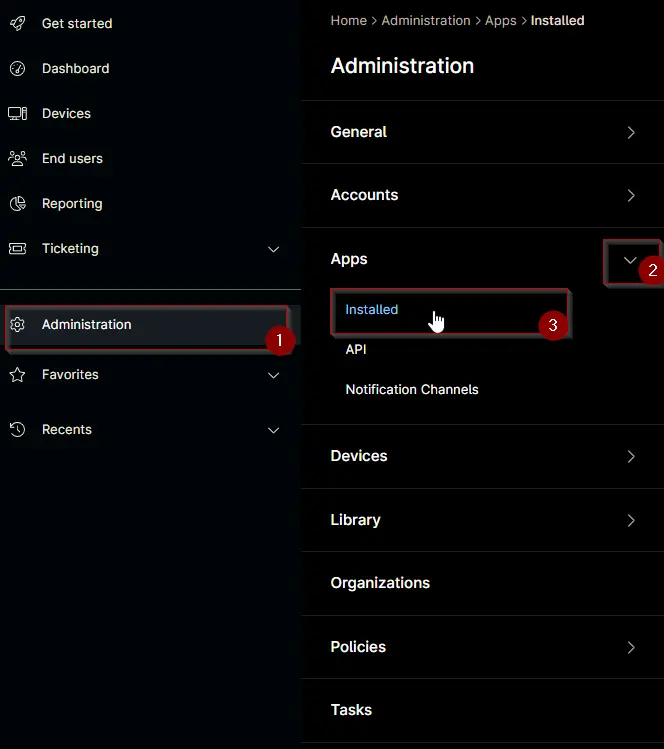
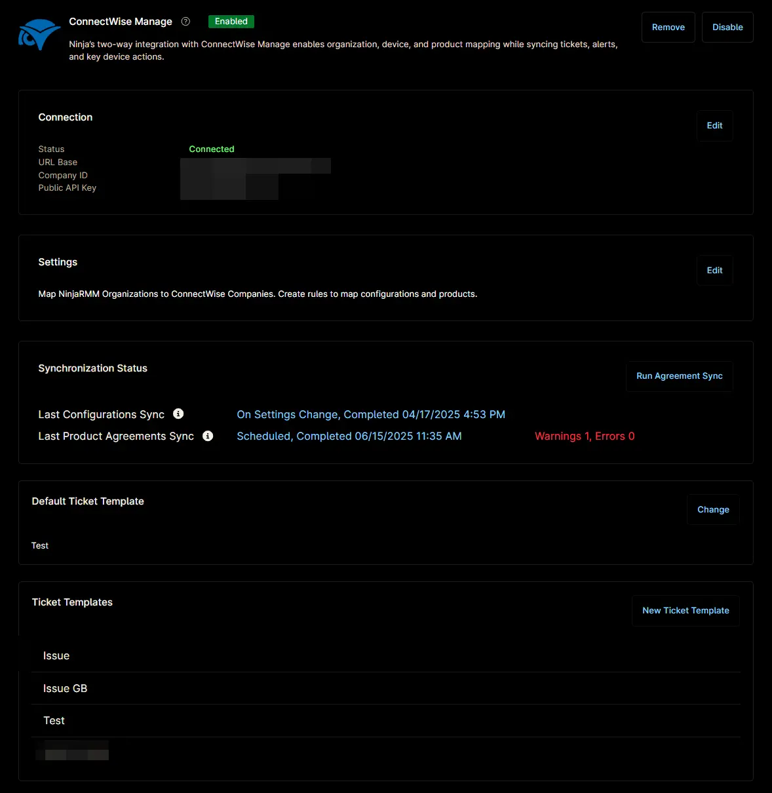
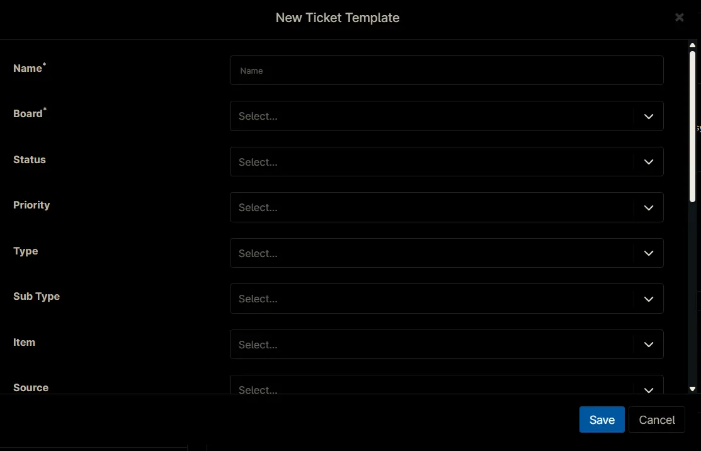

## Overview

## Requirement

Ensure that the ConnectWise Manage app is enabled and connected.  

## Dependencies

## Template Creation

### Step 1

Go to `Administration` > `Apps` > `Installed`.  

### Step 2

Find the `ConnectWise Manage` app under the `Third-party apps` section and select it.  

The ConnectWise Manage Configuration window will appear.  

### Step 3

In the `Ticket Templates` section, click the `New Ticket Template` button.  

The New Ticket Template Configuration window will open.  

### Step 4

Enter the required details and click `Save`.

**Name:**  
**Board:**  
**Status:**  
**Priority:**  
**Type:**  
**Sub Type:**  
**Item:**  
**Source:**  
**Team:**  
**Severity:**  
**Impact:**  
**Create and close status:**  
**Ticket Title Contents:**  
**When condition is reset:**  
**When condition retriggers:**  

## Completed Template
