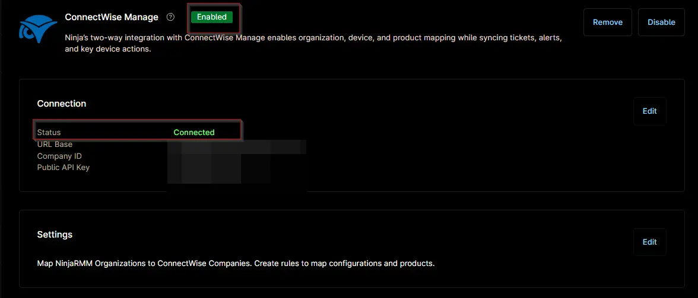

## Overview

## Requirement

Ensure that the ConnectWise Manage app is enabled and connected.  

## Dependencies

## Template Creation

[CW Manage Ticket Template Configuration](https://github.com/ProVal-Tech/ninjarmm/blob/main/cw-manage-ticket-templates/_template.toml)
