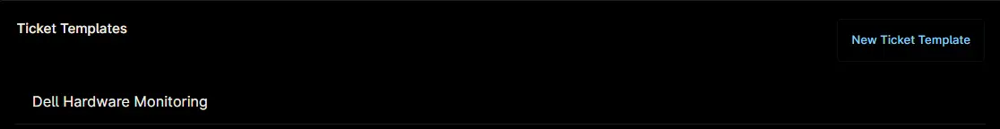

## Overview

This ticket template configures how a ConnectWise Manage ticket will be generated in response to the [Dell OMSA Alerts](/docs/2bff6ade-58ff-4cbf-addc-067b90da09e9) condition.

## Requirement

Ensure that the ConnectWise Manage app is enabled and connected.  

## Dependencies

- [Condition - Dell OMSA Alerts](/docs/2bff6ade-58ff-4cbf-addc-067b90da09e9)
- [Automation - Dell Hardware Monitoring](/docs/45c545e2-a890-4ca8-acfc-5b100c2e100c)
- [Solution - Dell Hardware Monitoring](/docs/9980ae21-5d47-4b76-b5ad-0e6600e0c304)

## Template Creation

### Step 1

Go to `Administration` > `Apps` > `Installed`.  

### Step 2

Find the `ConnectWise Manage` app under the `Third-party apps` section and select it.  

The ConnectWise Manage Configuration window will appear.  

### Step 3

In the `Ticket Templates` section, click the `New Ticket Template` button.  

The New Ticket Template Configuration window will open.  

### Step 4

Enter the required details and click `Save`.

- **Name:** `Dell Hardware Monitoring`  
- **Board:** `Help Desk`  
- **Status:** `New`  
- **Priority:** `Priority 2 - High`  
- **Type:** `MUST CHANGE`  
- **Sub Type:** `<Leave it blank or set required sub type>`  
- **Item:** `<Leave it blank or set required Item>`  
- **Source:** `Portal`  
- **Team:** `Service Team`  
- **Severity:** `High`  
- **Impact:** `High`  
- **Create and close status:** `Resolved`  
- **Ticket Title Contents:** `Custom Text` `Device Name`  
- **Custom Text:** `Dell OMSA Alert for`  
- **When condition is reset:** `Do not change`  
- **When condition retriggers:** `Create new ticket`  

**Note:** The details above may differ depending on environment. Please verify the required information with consultant or partner before completing these fields.

## Completed Template

