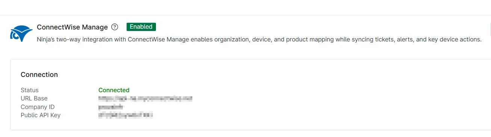

## Overview

This ticket template configures how a ConnectWise Manage ticket will be generated in response to the [Compound Condition - DHCP Scope Alert](/docs/dd4bfa5c-ab91-46f0-a0aa-9ebb83175e09) compound condition.

## Requirement

Ensure that the ConnectWise Manage app is enabled and connected.  

## Dependencies

- [Automation - DHCP Scope(s) < 5 IP Addresses](/docs/f36ee848-8f7a-48e1-8cfa-e5407a35b6e8)
- [Compound Condition - DHCP Scope Alert](/docs/dd4bfa5c-ab91-46f0-a0aa-9ebb83175e09)
- [Solution - DHCP Scope(s) < 5 IP Addresses](/docs/25ae26d7-19ef-4df6-8ea0-a179b5599dc28)

## Template Creation

[CW Manage Ticket Template Configuration](https://github.com/ProVal-Tech/ninjarmm/blob/main/cw-manage-ticket-templates/dhcp-scopes-ip-alerts.toml)

## Changelog

### 2026-07-28

- Initial version of the document
