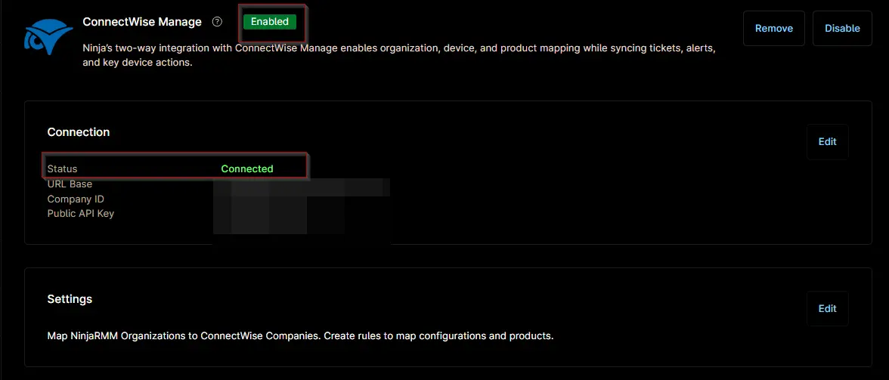

## Overview
This ticket template configures how a ConnectWise Manage ticket will be generated in response to the [Domain Admin Account LockOut](/docs/588b31d4-04a3-4b39-af8c-6c1f24da0710) condition.

## Requirement

Ensure that the ConnectWise Manage app is enabled and connected.  

## Dependencies
- [Solution : Domain Admin Account LockOut](/docs.87830e26-2018-4cd1-ba7e-a66fae0aa7e6)
- [Script : Domain Admin Account LockOut](/docs/54cb9acb-d11d-4a88-a0ca-92032b46fe23)
- [Condition : Domain Admin Account LockOut](/docs/588b31d4-04a3-4b39-af8c-6c1f24da0710)

## Template Creation

[CW Manage Ticket Template Configuration](https://github.com/ProVal-Tech/ninjarmm/blob/main/cw-manage-ticket-templates/domain-admin-account-lockouts.toml)
