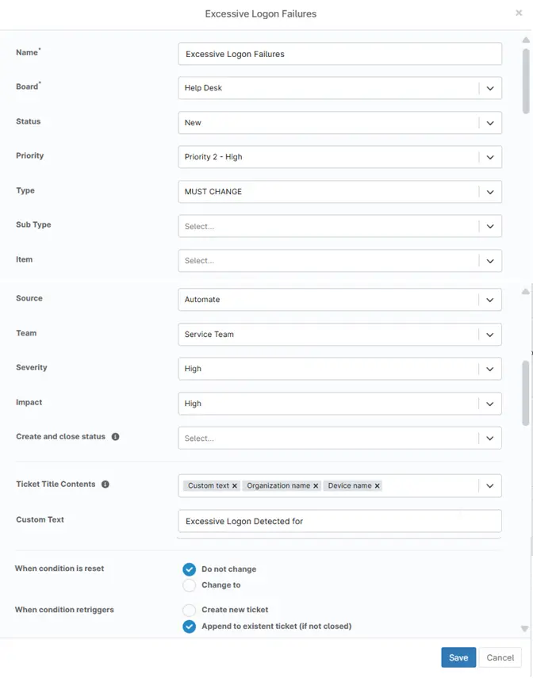
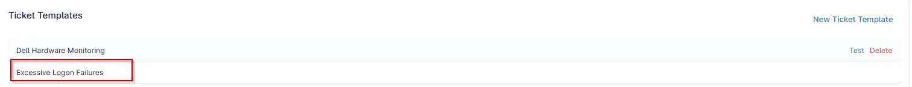

## Overview
This ticket template configures how a ConnectWise Manage ticket will be generated in response to the [Excessive Logon Attempts](/docs/d8ab94a8-8b00-401b-b1a4-48b7fd2713ae) condition.

## Requirement

Ensure that the ConnectWise Manage app is enabled and connected.  

## Dependencies
- [Automation - Excessive Logon Attempts](/docs/3b52c821-6c63-4da6-87e8-8bd5c96e78de)
- [Condition - Excessive Logon Attempts](/docs/d8ab94a8-8b00-401b-b1a4-48b7fd2713ae)

## Template Creation

### Step 1

Go to `Administration` > `Apps` > `Installed`.  

### Step 2

Find the `ConnectWise Manage` app under the `Third-party apps` section and select it.  

The ConnectWise Manage Configuration window will appear.  

### Step 3

In the `Ticket Templates` section, click the `New Ticket Template` button.  

The New Ticket Template Configuration window will open.  

### Step 4

Enter the required details and click `Save`.

- **Name:**  `Excessive Logon Failures`
- **Board:**  `Help Desk`
- **Status:**  `New`
- **Priority:**  `Priority 2 - High`
- **Type:**  `MUST CHANGE`
- **Sub Type:**  
- **Item:**  
- **Source:**  `Automate`
- **Team:**  `Service Team`
- **Severity:**  `High`
- **Impact:**  `High`
- **Create and close status:**  
- **Ticket Title Contents:**  `Custom text` `Organization name` `Device name`
- **Custom Text** `Excessive Logon Detected for`
- **When condition is reset:**  `Do not change`
- **When condition retriggers:**  `Append to existent ticket (if not closed)`

## Completed Template
