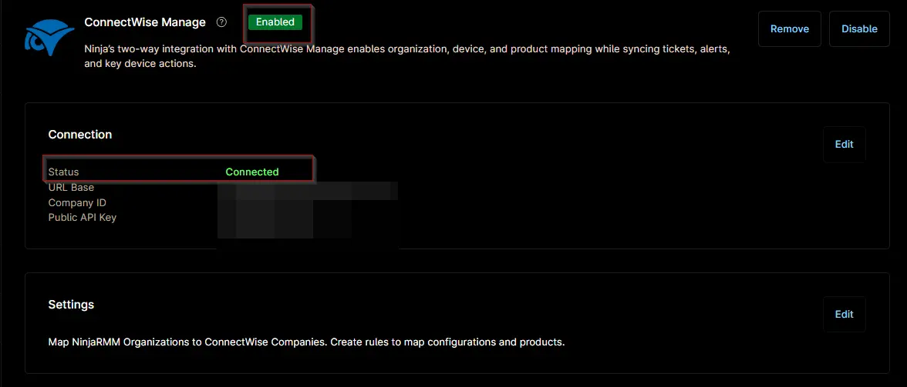

## Overview

This ticket template configures how a ConnectWise Manage ticket will be generated in response to the [Lock Stolen Systems](/docs/705b400b-28fc-4c01-95a6-edbf43960122) condition.

## Requirement

Ensure that the ConnectWise Manage app is enabled and connected.  

## Dependencies
- [Solution  - Lock Stolen System](/docs/13b4df99-df9b-4a57-bc0f-8675c68be028)

## Template Creation

[CW Manage Ticket Template Configuration](https://github.com/ProVal-Tech/ninjarmm/blob/main/cw-manage-ticket-templates/lock-stolen-system.toml)
