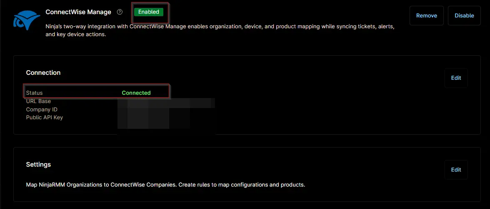

## Overview

This ticket template configures how a ConnectWise Manage ticket will be generated in response to the [Compound Condition : Monitor SSL Cert Expiration - Workstations](/docs/8c096a91-90f6-4c25-a5dc-745598b19e11) and [Compound Condition : Monitor SSL Cert Expiration - Servers](/docs/79d5020a-7487-42ad-9dc3-1cfd7d675be5) condition.

## Requirement

Ensure that the ConnectWise Manage app is enabled and connected.  

## Dependencies

- [Solution - SSL Certificate Audit](/docs/cf5acc69-183c-4838-9484-2f3d9a247877)

## Template Creation

[CW Manage Ticket Template Configuration](https://github.com/ProVal-Tech/ninjarmm/blob/main/cw-manage-ticket-templates/ssl-cert-expiration-alerts.toml)

## Changelog

### 2026-07-20

- Initial version of the document