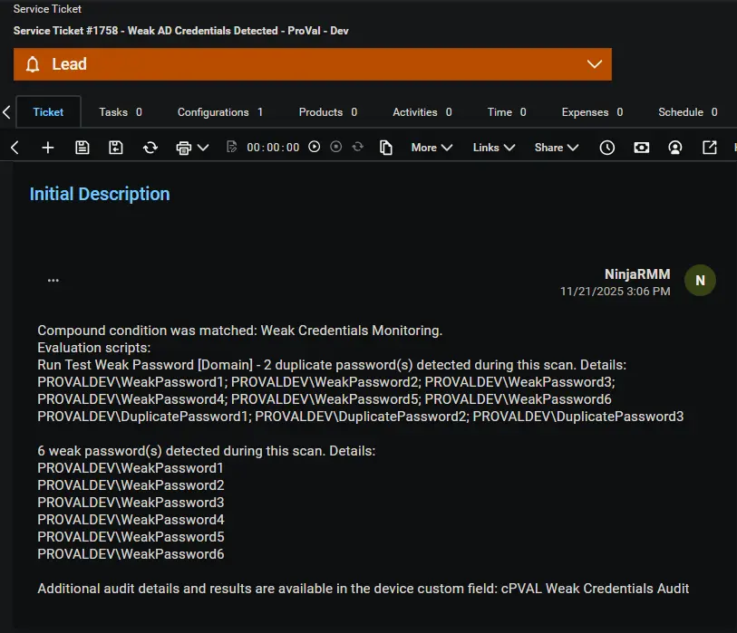

## Overview

Template for creating a CW-Manage ticket from [Weak Credentials Monitoring](/docs/4e7c3666-86ba-458c-80e8-3c7ecb390518) compound conditions.

## Requirement

Ensure that the ConnectWise Manage app is enabled and connected.  

## Dependencies

- [Solution: Weak Credentials Monitoring](/docs/7d087aad-e93d-45d6-bc30-b31f8e78d6e6)

## Template Creation

[CW Manage Ticket Template Configuration](https://github.com/ProVal-Tech/ninjarmm/blob/main/cw-manage-ticket-templates/weak-ad-passwords.toml)

## Sample CW Manage Ticket

