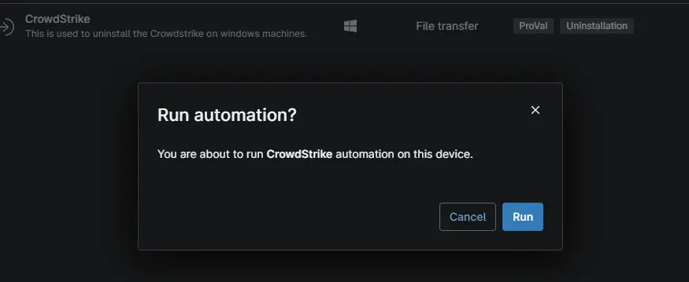

## Overview

This is used to upload the CrowdStrike uninstaller executable `.exe` and transfer it to the specified location.

## Sample Run

## Dependencies

- [Automation - Uninstall CrowdStrike](/docs/3d721829-3986-4700-8eb5-5b1f746d460a)
- [Solution - Uninstall-Crowdstrike-Ninjaone](/docs/96ec2315-d8e2-4793-8db9-8d3f73803945)

## Template Creation

[File Transfer](https://github.com/ProVal-Tech/ninjarmm/blob/main/file-transfer/crowdstrike.toml)

## Changelog

### 2026-10-09

Initial version of the script.
